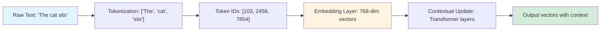

<style>
.slidev-layout h1 {
  border-bottom: 1px solid #010d21;
  padding-bottom: 0.5rem;
  margin-bottom: 1rem;
}
</style>

# **Large Language Models (LLM)**

A Comprehensive Guide to Principles and Training Method

<div class="pt-15">
  <div class="text-lg">
    <strong>Kai Ye</strong>
  </div>
  <div class="flex items-center justify-center gap-4 pt-2">
    <a href="https://noncollapse.github.io/" target="_blank" class="text-blue-400 hover:text-blue-300 text-2xl" title="Homepage">
      🏠
    </a>
    <a href="https://scholar.google.com/citations?user=a7G8Yo8AAAAJ" target="_blank" class="text-blue-400 hover:text-blue-300 text-2xl" title="Google Scholar">
      🎓
    </a>
    <a href="https://huggingface.co/Kyleyee" target="_blank" class="text-blue-400 hover:text-blue-300 text-2xl" title="Hugging Face">
      🤗
    </a>
  </div>
  <div class="text-base opacity-80 pt-2">
    LSE | Stats-Powered AI
  </div>
</div>

<div class="pt-20">
  <span @click="$slidev.nav.next" class="px-2 py-1 rounded cursor-pointer" hover="bg-white bg-opacity-10">
    Start <carbon:arrow-right class="inline"/>
  </span>
</div>

---
layout: default
---

# Table of Contents

## Part 1: Foundations
- Introduction to LLMs
- Transformer Architecture

## Part 2: Pre-training and Supervised Fine-Tuning
- Pre-training Methods
- Supervised Fine-Tuning (SFT)

## Part 3: Reinforcement Learning
- RLHF (Reinforcement Learning from Human Feedback)
- RLVR (Reinforcement Learning with Verifiable Rewards)

---
layout: section
---

# Part 1: Foundations

---

# What are Large Language Models?

<div class="grid grid-cols-2 gap-4">


</div>

<div class="relative h-32">

<div class="text-center mt-8 text-2xl font-bold">
We can ask the LLMs themselves!
</div>

</div>


---

# Evolution of LLM

<div class="flex justify-center">
<div class="w-full">

<div class="mt-15"></div>

<style>
.mermaid svg text {
  font-size: 3rem !important;
  font-weight: bold !important;
}
</style>


</div>
</div>

<div class="text-center mt-4 text-xl font-semibold">
LLM Development Timeline
</div>

---

# Number of LLMs Per Month (2024)

<div class="grid grid-cols-1 gap-6">


</div>

---
layout: section
---

# Transformer Architecture

---

# Before Transformer: How Words Become Numbers?

<div class="text-center text-2xl mt-8">
Understanding Embeddings is the <span class="text-blue-500 font-bold">KEY</span> to understanding Transformer
</div>

<div class="mt-12 grid grid-cols-3 gap-8">

<div class="text-center">
<div class="text-6xl mb-4">🐱</div>
<div class="text-xl">Cat</div>
<div class="text-sm opacity-70 mt-2">Human Language</div>
</div>

<div class="text-center flex items-center justify-center">
<div class="text-6xl">→</div>
</div>

<div class="text-center">
<div class="text-4xl mb-4 font-mono">[0.2, 0.8, -0.1, ...]</div>
<div class="text-xl">Vector</div>
<div class="text-sm opacity-70 mt-2">Machine Understanding</div>
</div>

</div>

---

# Why Not Just Use Word IDs?

<div class="grid grid-cols-2 gap-8 mt-8">

<div>

## Simple Numbering ❌

```python
word_to_id = {
    "cat": 1,
    "dog": 2,
    "kitten": 3,
    ...
    "airplane": 9999
}
```

<div class="mt-6">

**Problems:**
- No semantic meaning
- "cat" (1) vs "dog" (2): distance = 1
- "cat" (1) vs "airplane" (9999): distance = 9998
- A numeric index has no semantic meaning!

</div>

</div>

<div>

## What We Need ✓

<div class="mt-4">

**Semantic Distance:**
- Similar words → Close in space
- Different words → Far in space

</div>

<div class="mt-8 text-center">
<div class="text-base">
Cat 🐱 ≈ Dog 🐕 ≈ Kitten 🐈
</div>
<div class="text-sm opacity-60 mt-4">↕ (far)</div>
<div class="text-base mt-4">
Airplane ✈️
</div>
</div>

<div class="mt-8 p-4 bg-blue-100 rounded">
💡 Neural networks need <strong>distance = similarity</strong>
</div>

</div>

</div>

---

# From One-Hot to Embedding

<div class="grid grid-cols-2 gap-8">

<div>

## One-Hot Encoding

```python
vocab_size = 50000

"cat" → [0, 1, 0, 0, ..., 0]
"dog" → [0, 0, 1, 0, ..., 0]
"the" → [1, 0, 0, 0, ..., 0]
```

**Issues:**
- ❌ Dimension = vocabulary size (huge!)
- ❌ Sparse (99.9% are zeros)
- ❌ No similarity (all perpendicular)

</div>

<div>

## Embedding

```python
embedding_dim = 768

"cat" → [0.2, 0.8, -0.1, ..., 0.5]
"dog" → [0.3, 0.7, -0.2, ..., 0.4]
"the" → [-0.5, 0.1, 0.9, ..., -0.2]
```

**Benefits:**
- ✓ Low dimension (e.g., 768)
- ✓ Dense (all values meaningful)
- ✓ **Cosine similarity** captures meaning


</div>

</div>

<div class="mt-6 p-4 bg-green-100 rounded text-center">
<strong>Key Idea:</strong> Compress 50,000 dimensions → 4096 dimensions in Llama3 and 3584 in Qwen2.5
</div>

---

# Where Does Semantic Meaning Come From?

<div class="mt-8">

## 🎯 Task-Driven Learning

<v-clicks>

<div class="text-xl mt-6">
<strong>Critical Point 1:</strong> Embeddings are <span class="text-red-500">NOT hand-crafted</span>
</div>

<div class="text-xl mt-4">
They are <span class="text-blue-500">learned automatically</span> during training to accomplish a task
</div>

<!-- <div class="mt-8 p-4 bg-yellow-100 rounded">

**Example: Word2Vec**
- Task: Predict surrounding words
- "The cat sits on the ___" → model learns "mat" is likely
- Through millions of examples, "cat", "dog", "kitten" end up close in space

</div> -->

<div class="text-xl mt-8">
<strong>Critical Point 2:</strong> In LLMs, embeddings are <span class="text-purple-500">dynamic</span>
</div>

<div class="mt-4">
They get updated by context → <strong>Contextual Embeddings</strong> (foundation of BERT/GPT)
</div>

</v-clicks>

</div>

---

# Tokenization: The Real Input to LLMs

<div class="grid grid-cols-2 gap-8">

<div>

## Not Words, but Tokens! 🔤

**Why subword tokenization?**

<v-clicks>

1. **Rare words**
   - "unhappiness" → "un" + "happiness"

2. **Spelling variations**
   - "running", "runs", "ran" → share "run"

3. **Abbreviations & symbols**
   - "don't" → "don" + "'t"
   - "😊" → special token

</v-clicks>

</div>

<div>

## Example: BPE Tokenization

```python
text = "tokenization is important"

# Tokenizer output (example; varies by tokenizer)
tokens = ["token", "ization", " is", " import", "ant"]

# Lookup in embedding matrix E: R^{|V| x d_model}
# Output shape: (seq_len, d_model)
embeddings = [
    [0.1, 0.2, ...],     # embedding("token")
    [0.3, -0.1, ...],    # embedding("ization")
    [0.5, 0.8, ...],     # embedding(" is")
    ...
]

```

<div class="mt-8 p-4 bg-orange-100 rounded">
<strong>Remember:</strong> LLMs process <span class="text-red-500">token sequences</span>, not "words" as you think!
</div>

</div>

</div>

---

# Putting It All Together


<div class="mt-8 grid grid-cols-3 gap-4">

<div class="p-4 border rounded">
<div class="font-bold mb-2">① Tokenization</div>
Text → Token sequence
</div>

<div class="p-4 border rounded">
<div class="font-bold mb-2">② Static Embedding</div>
Token → Initial vector
</div>

<div class="p-4 border rounded">
<div class="font-bold mb-2">③ Contextualization</div>
Vector updated by context<br/>(This is where Transformer works!)
</div>

</div>



---

# Positional Encoding: Teaching Position to Transformers

<div class="text-center text-xl mt-6">
🤔 Problem: Embeddings have <span class="text-red-500">no position information</span>!
</div>

<div class="grid grid-cols-2 gap-8 mt-8">

<div>

**Same embeddings, different meanings:**

```
"The cat chased the dog"
"The dog chased the cat"
```

<div class="mt-4">
Without position info, these look <span class="text-red-500">identical</span> to the model!
</div>

</div>

<div>

**Solution: Add Position Information**

<v-clicks>

1. **Original Transformer**: Sinusoidal PE
   - Add position vectors to embeddings

2. **Modern LLMs (Llama, GPT)**: RoPE
   - Rotate Q/K in attention
   - Better long-context performance

</v-clicks>

</div>

</div>

---

# Method 1: Sinusoidal Positional Encoding

<div class="grid grid-cols-2 gap-6">

<div>

## Core Idea

Use sine and cosine functions to encode position:

$$
\begin{aligned}
PE(pos, 2i) &= \sin\left(\frac{pos}{10000^{2i/d}}\right) \\
PE(pos, 2i+1) &= \cos\left(\frac{pos}{10000^{2i/d}}\right)
\end{aligned}
$$

<div class="mt-6">

- `pos`: position in sequence (0, 1, 2, ...)
- `i`: dimension index
- `d`: embedding dimension (e.g., 768)

</div>

</div>

<div>

## How to Use

<div class="mt-4">

**Simple: Just add them element-wise!**

$$
\boxed{\text{Final Vector} = \text{Embedding} + \text{Position Encoding}}
$$

</div>

<div class="mt-8">

<style>
  .vector-box {
    display: inline-flex;
    width: 45px;
    height: 45px;
    border: 2px solid #333;
    border-radius: 6px;
    align-items: center;
    justify-content: center;
    font-weight: bold;
    font-size: 13px;
    margin: 2px;
    transition: all 0.5s ease;
  }
  .embed-box {
    background: linear-gradient(135deg, #667eea 0%, #764ba2 100%);
    color: white;
  }
  .pos-box {
    background: linear-gradient(135deg, #f093fb 0%, #f5576c 100%);
    color: white;
  }
  .result-box {
    background: linear-gradient(135deg, #4facfe 0%, #00f2fe 100%);
    color: white;
    transform: scale(1.1);
    box-shadow: 0 4px 15px rgba(0,0,0,0.3);
  }
  .vector-row {
    display: flex;
    align-items: center;
    justify-content: center;
    margin: 12px 0;
  }
  .operator {
    font-size: 28px;
    font-weight: bold;
    margin: 0 10px;
    color: #333;
  }
  .label {
    font-size: 16px;
    font-weight: bold;
    margin-bottom: 8px;
    text-align: center;
  }
  .merge-box {
    background: linear-gradient(135deg, #667eea 0%, #f093fb 100%);
    color: white;
  }
  .overlay-wrap {
    display: grid;
  }
  .overlay-item {
    grid-area: 1 / 1;
  }
  .merge-block {
    opacity: 1;
    animation: merge-fade 1.0s ease forwards;
  }
  .result-fade {
    opacity: 0;
    animation: result-fade 0.6s ease forwards;
    animation-delay: 0.6s;
  }
  @keyframes merge-fade {
    0% { opacity: 1; transform: scale(1); }
    60% { opacity: 1; transform: scale(0.99); }
    100% { opacity: 0; transform: scale(0.99); }
  }
  @keyframes result-fade {
    0% { opacity: 0; }
    100% { opacity: 1; }
  }
</style>

<div class="text-center text-lg font-bold mb-4">
Token "cat" at Position 1
</div>

<div v-show="$slidev.nav.clicks < 3">
  <!-- Step 1: Show Embedding (visible on click 1 and 2, hidden on click 3+) -->
  <div v-click="1" class="p-4 bg-gradient-to-r from-blue-50 to-purple-50 rounded-lg">
    <div class="label" style="color: #667eea;">🟣 Token Embedding</div>
    <div class="vector-row">
      <div class="vector-box embed-box">0.3</div>
      <div class="vector-box embed-box">-0.4</div>
      <div class="vector-box embed-box">0.6</div>
      <div class="vector-box embed-box">0.2</div>
      <div class="vector-box embed-box">-0.1</div>
      <div class="vector-box embed-box">0.8</div>
    </div>
  </div>

  <!-- Step 2: Show Position Encoding (visible on click 2, hidden on click 3+) -->
  <div v-click="2" class="p-4 bg-gradient-to-r from-blue-50 to-purple-50 rounded-lg mt-4">
    <div class="label" style="color: #f093fb;">🔴 Position Encoding (pos=1)</div>
    <div class="vector-row">
      <div class="vector-box pos-box">0.8</div>
      <div class="vector-box pos-box">0.5</div>
      <div class="vector-box pos-box">0.1</div>
      <div class="vector-box pos-box">0.9</div>
      <div class="vector-box pos-box">0.2</div>
      <div class="vector-box pos-box">-0.3</div>
    </div>
    <div class="text-center mt-4 mb-2">
      <div class="operator">⬇</div>
      <div class="text-sm font-semibold">Element-wise Addition</div>
    </div>
  </div>
</div>

<span v-click="3" class="hidden"></span>

<!-- Step 3: Overlay container for merge animation -->
<div class="relative mt-4" style="min-height: 150px;">
  <!-- Step 3a: Show Merged Vector (on click 3, then fade out) -->
  <div v-show="$slidev.nav.clicks >= 3" class="absolute top-0 left-0 right-0 p-4 bg-gradient-to-r from-blue-50 to-purple-50 rounded-lg merge-block">
    <div class="label" style="color: #7b5bd6;">🟣 Embedding + Position Encoding</div>
    <div class="vector-row">
      <div class="vector-box merge-box">1.1</div>
      <div class="vector-box merge-box">0.1</div>
      <div class="vector-box merge-box">0.7</div>
      <div class="vector-box merge-box">1.1</div>
      <div class="vector-box merge-box">0.1</div>
      <div class="vector-box merge-box">0.5</div>
    </div>
  </div>

  <!-- Step 3b: Show Final Result (fade in after merge) -->
  <div v-show="$slidev.nav.clicks >= 3" class="absolute top-0 left-0 right-0 p-4 bg-gradient-to-r from-blue-50 to-purple-50 rounded-lg result-fade">
    <div class="label" style="color: #4facfe;">🔵 Final Result (Position-aware)</div>
    <div class="vector-row">
      <div class="vector-box result-box">1.1</div>
      <div class="vector-box result-box">0.1</div>
      <div class="vector-box result-box">0.7</div>
      <div class="vector-box result-box">1.1</div>
      <div class="vector-box result-box">0.1</div>
      <div class="vector-box result-box">0.5</div>
    </div>
    <div class="mt-3 text-center text-xs text-gray-600">
      ✨ Now each token has unique position information embedded!
    </div>
  </div>
</div>

</div>

</div>

</div>

---

# Method 2: RoPE (Rotary Positional Embedding)

<div class="grid grid-cols-2 gap-6">

<div>

## Why RoPE? 🔄

**Problem with additive PE:**
- Position info can "fade" through layers
- Not ideal for very long contexts

**RoPE Solution:**
- Don't add to embeddings
- Instead, <span class="text-blue-500">rotate Q and K</span> in attention
- Position encoded in the rotation angle

</div>

<div>

## Core Formula

$$
\begin{aligned}
q' &= R(pos) \cdot q \\
k' &= R(pos) \cdot k
\end{aligned}
$$

Where $R(pos)$ is a rotation matrix built from sin/cos:

$$
R(pos) = \begin{bmatrix}
\cos(pos\theta) & -\sin(pos\theta) \\
\sin(pos\theta) & \cos(pos\theta)
\end{bmatrix}
$$

Applied to every 2 dimensions (2D rotation for each pair)

</div>

</div>

---

# RoPE: Rotation in Action 🌀

<div class="mt-4">

## Step-by-step Process

<v-clicks>

<div class="grid grid-cols-2 gap-8 mt-6">

<div>

**1. Original Query Vector (768-dim)**

```python
q = [q₀, q₁, q₂, q₃, q₄, q₅, ...]
     ↓   ↓   ↓   ↓   ↓   ↓
   pair pair pair pair...
```

**2. Apply 2D Rotation to Each Pair**

```python
# For dimensions (q₀, q₁):
q'₀ = q₀·cos(pos·θ₀) - q₁·sin(pos·θ₀)
q'₁ = q₀·sin(pos·θ₀) + q₁·cos(pos·θ₀)

# For dimensions (q₂, q₃):
q'₂ = q₂·cos(pos·θ₁) - q₃·sin(pos·θ₁)
q'₃ = q₂·sin(pos·θ₁) + q₃·cos(pos·θ₁)
```

</div>

<div>

**3. Visual Intuition**

<div class="text-center mt-4">
<div class="text-6xl">🔄</div>
<div class="text-base mt-4">
Each position rotates vectors by different angles
</div>
</div>

<div class="mt-6 p-4 bg-green-100 rounded">
**Why it works:**

Position 0: 0° rotation  
Position 1: θ rotation  
Position 2: 2θ rotation  
...

Relative position encoded in rotation difference!
</div>

</div>

</div>

</v-clicks>

</div>

---

# RoPE vs Sinusoidal PE: Comparison

<div class="grid grid-cols-2 gap-6 mt-8">

<div>

## Sinusoidal PE

**Method:**
```python
x = embedding + PE
```

**Pros:**
- ✓ Simple and intuitive
- ✓ Fast to compute
- ✓ Works well for short sequences

**Cons:**
- ✗ Position info can decay in deep layers
- ✗ Less effective for very long contexts

**Used in:**
- Original Transformer (2017)
- BERT
- Early GPT models

</div>

<div>

## RoPE (Rotary PE)

**Method:**
```python
q' = rotate(q, pos)
k' = rotate(k, pos)
# In attention layer
```

**Pros:**
- ✓ Position info preserved in rotations
- ✓ Better for long contexts
- ✓ Relative position naturally encoded

**Cons:**
- ✗ Slightly more complex
- ✗ Requires rotation computation

**Used in:**
- **LLaMA series** 🦙
- **GPT-NeoX**
- **PaLM**
- Most modern LLMs

</div>

</div>

<div class="mt-6 text-center p-4 bg-purple-100 rounded">
<strong>Trend:</strong> Modern LLMs prefer <span class="text-purple-600">RoPE</span> for better long-context performance! 📈
</div>

---

# Transformer: The Foundation

<div class="grid grid-cols-2 gap-4">

<div>

## Core Components

- **Positional Encoding**
  - Preserves sequence order information

- **Self-Attention Mechanism**
  - Captures long-range dependencies
  - High parallel computation efficiency

- **Multi-Head Attention**
  - Learns representations from multiple subspaces

- **Feed-Forward Neural Network**
  - Non-linear transformations

</div>

<div>

```python
# Core Attention Formula
def attention(Q, K, V):
    """
    Q: Query
    K: Key
    V: Value
    """
    d_k = K.size(-1)
    scores = Q @ K.transpose(-2, -1)
    scores = scores / sqrt(d_k)
    attention_weights = softmax(scores)
    output = attention_weights @ V
    return output
```

<style>
  .qkv-btn {
    display: inline-block;
    padding: 6px 16px;
    margin: 0 4px;
    border-radius: 8px;
    cursor: pointer;
    font-weight: bold;
    transition: all 0.3s ease;
    font-size: 16px;
  }
  .q-btn {
    background: linear-gradient(135deg, #667eea 0%, #764ba2 100%);
    color: white;
  }
  .k-btn {
    background: linear-gradient(135deg, #f093fb 0%, #f5576c 100%);
    color: white;
  }
  .v-btn {
    background: linear-gradient(135deg, #4facfe 0%, #00f2fe 100%);
    color: white;
  }
  .qkv-btn:hover {
    transform: scale(1.1);
    box-shadow: 0 4px 15px rgba(0,0,0,0.3);
  }
  .qkv-modal-overlay {
    position: fixed;
    top: 0;
    left: 0;
    right: 0;
    bottom: 0;
    background: rgba(0, 0, 0, 0.75);
    display: flex;
    align-items: center;
    justify-content: center;
    z-index: 9999;
    padding: 20px;
  }
  .qkv-modal-content {
    background: white;
    padding: 32px;
    border-radius: 16px;
    max-width: 650px;
    max-height: 85vh;
    overflow-y: auto;
    box-shadow: 0 20px 60px rgba(0,0,0,0.4);
    position: relative;
  }
  .qkv-close-btn {
    position: absolute;
    top: 16px;
    right: 16px;
    background: rgba(0,0,0,0.6);
    color: white;
    border: none;
    border-radius: 50%;
    width: 36px;
    height: 36px;
    cursor: pointer;
    font-size: 24px;
    display: flex;
    align-items: center;
    justify-content: center;
    transition: all 0.3s ease;
    font-weight: bold;
  }
  .qkv-close-btn:hover {
    background: rgba(0,0,0,0.9);
    transform: scale(1.15);
  }
  .matrix-diagram {
    display: flex;
    align-items: center;
    justify-content: center;
    gap: 20px;
    margin: 24px 0;
  }
  .matrix-box {
    display: grid;
    gap: 2px;
    border: 3px solid #333;
    padding: 4px;
    border-radius: 8px;
  }
  .matrix-input {
    grid-template-columns: repeat(7, 30px);
    grid-template-rows: repeat(6, 30px);
    background: linear-gradient(135deg, #4facfe 0%, #00f2fe 100%);
  }
  .matrix-weight-q {
    grid-template-columns: repeat(3, 30px);
    grid-template-rows: repeat(7, 30px);
    background: linear-gradient(135deg, #f5e6d3 0%, #e8d5b7 100%);
  }
  .matrix-weight-k {
    grid-template-columns: repeat(3, 30px);
    grid-template-rows: repeat(7, 30px);
    background: linear-gradient(135deg, #e8f5e9 0%, #c8e6c9 100%);
  }
  .matrix-weight-v {
    grid-template-columns: repeat(3, 30px);
    grid-template-rows: repeat(7, 30px);
    background: linear-gradient(135deg, #e1d5e7 0%, #d4c5d9 100%);
  }
  .matrix-result-q {
    grid-template-columns: repeat(3, 30px);
    grid-template-rows: repeat(6, 30px);
    background: linear-gradient(135deg, #ffd54f 0%, #ffb300 100%);
  }
  .matrix-result-k {
    grid-template-columns: repeat(3, 30px);
    grid-template-rows: repeat(6, 30px);
    background: linear-gradient(135deg, #aed581 0%, #7cb342 100%);
  }
  .matrix-result-v {
    grid-template-columns: repeat(3, 30px);
    grid-template-rows: repeat(6, 30px);
    background: linear-gradient(135deg, #ba68c8 0%, #9c27b0 100%);
  }
  .matrix-cell {
    background: rgba(255,255,255,0.3);
    border: 1px solid rgba(0,0,0,0.1);
  }
  .matrix-label {
    font-size: 18px;
    font-weight: bold;
    text-align: center;
  }
  .operator {
    font-size: 30px;
    font-weight: bold;
  }
</style>

<script setup>
import { ref } from 'vue'
const showModal = ref('')
</script>


$$
\text{Attention}(\textcolor{#667eea}{\boxed{Q}},\textcolor{#f093fb}{\boxed{K}},\textcolor{#4facfe}{\boxed{V}}) = \text{softmax}\left(\frac{QK^T}{\sqrt{d_k}}\right)V
$$

<div class="grid grid-cols-3 gap-4 mt-6">
  <div class="qkv-btn q-btn text-center" @click="showModal = 'Q'">
    Q - Query
  </div>
  <div class="qkv-btn k-btn text-center" @click="showModal = 'K'">
    K - Key
  </div>
  <div class="qkv-btn v-btn text-center" @click="showModal = 'V'">
    V - Value
  </div>
</div>

<!-- Modal for Q (Query) -->
<div v-if="showModal === 'Q'" class="qkv-modal-overlay" @click.self="showModal = ''">
  <div class="qkv-modal-content">
    <button class="qkv-close-btn" @click="showModal = ''">×</button>
    
<div style="background: #f0f4ff; padding: 20px; border-radius: 12px; margin-top: 24px;">
<h4 style="color: #667eea; font-size: 20px; margin-bottom: 12px;">💡 Role of Query</h4>

- **Purpose**: Represents "what information am I looking for?"
- **Computation**: `Q = X @ W_Q` (Input × Query Weights)
- **Meaning**: Each token generates its own "question" to match with other tokens' Keys

</div>

<div class="matrix-diagram">
  <div>
    <div class="matrix-label" style="color: #4facfe;">Input X</div>
    <div class="matrix-box matrix-input">
      <div class="matrix-cell"></div><div class="matrix-cell"></div><div class="matrix-cell"></div><div class="matrix-cell"></div><div class="matrix-cell"></div><div class="matrix-cell"></div><div class="matrix-cell"></div>
      <div class="matrix-cell"></div><div class="matrix-cell"></div><div class="matrix-cell"></div><div class="matrix-cell"></div><div class="matrix-cell"></div><div class="matrix-cell"></div><div class="matrix-cell"></div>
      <div class="matrix-cell"></div><div class="matrix-cell"></div><div class="matrix-cell"></div><div class="matrix-cell"></div><div class="matrix-cell"></div><div class="matrix-cell"></div><div class="matrix-cell"></div>
      <div class="matrix-cell"></div><div class="matrix-cell"></div><div class="matrix-cell"></div><div class="matrix-cell"></div><div class="matrix-cell"></div><div class="matrix-cell"></div><div class="matrix-cell"></div>
      <div class="matrix-cell"></div><div class="matrix-cell"></div><div class="matrix-cell"></div><div class="matrix-cell"></div><div class="matrix-cell"></div><div class="matrix-cell"></div><div class="matrix-cell"></div>
      <div class="matrix-cell"></div><div class="matrix-cell"></div><div class="matrix-cell"></div><div class="matrix-cell"></div><div class="matrix-cell"></div><div class="matrix-cell"></div><div class="matrix-cell"></div>
    </div>
    <div class="text-sm text-center mt-2">seq_len × d_model</div>
  </div>
  
  <div class="operator">×</div>
  
  <div>
    <div class="matrix-label" style="color: #d4a574;">W<sub>Q</sub></div>
    <div class="matrix-box matrix-weight-q">
      <div class="matrix-cell"></div><div class="matrix-cell"></div><div class="matrix-cell"></div>
      <div class="matrix-cell"></div><div class="matrix-cell"></div><div class="matrix-cell"></div>
      <div class="matrix-cell"></div><div class="matrix-cell"></div><div class="matrix-cell"></div>
      <div class="matrix-cell"></div><div class="matrix-cell"></div><div class="matrix-cell"></div>
      <div class="matrix-cell"></div><div class="matrix-cell"></div><div class="matrix-cell"></div>
      <div class="matrix-cell"></div><div class="matrix-cell"></div><div class="matrix-cell"></div>
      <div class="matrix-cell"></div><div class="matrix-cell"></div><div class="matrix-cell"></div>
    </div>
    <div class="text-sm text-center mt-2">d_model × d_k</div>
  </div>
  
  <div class="operator">=</div>
  
  <div>
    <div class="matrix-label" style="color: #ffc107;">Q</div>
    <div class="matrix-box matrix-result-q">
      <div class="matrix-cell"></div><div class="matrix-cell"></div><div class="matrix-cell"></div>
      <div class="matrix-cell"></div><div class="matrix-cell"></div><div class="matrix-cell"></div>
      <div class="matrix-cell"></div><div class="matrix-cell"></div><div class="matrix-cell"></div>
      <div class="matrix-cell"></div><div class="matrix-cell"></div><div class="matrix-cell"></div>
      <div class="matrix-cell"></div><div class="matrix-cell"></div><div class="matrix-cell"></div>
      <div class="matrix-cell"></div><div class="matrix-cell"></div><div class="matrix-cell"></div>
    </div>
    <div class="text-sm text-center mt-2">seq_len × d_k</div>
  </div>
</div>

  </div>
</div>

<!-- Modal for K (Key) -->
<div v-if="showModal === 'K'" class="qkv-modal-overlay" @click.self="showModal = ''">
  <div class="qkv-modal-content">
    <button class="qkv-close-btn" @click="showModal = ''">×</button>
    
<div style="background: #fff0f5; padding: 20px; border-radius: 12px; margin-top: 24px;">
<h4 style="color: #f093fb; font-size: 20px; margin-bottom: 12px;">💡 Role of Key</h4>

- **Purpose**: Represents "what information can I provide"
- **Computation**: `K = X @ W_K` (Input × Key Weights)
- **Meaning**: Each token's "label", used to be retrieved by other tokens' Queries

</div>

<div class="matrix-diagram">
  <div>
    <div class="matrix-label" style="color: #4facfe;">Input X</div>
    <div class="matrix-box matrix-input">
      <div class="matrix-cell"></div><div class="matrix-cell"></div><div class="matrix-cell"></div><div class="matrix-cell"></div><div class="matrix-cell"></div><div class="matrix-cell"></div><div class="matrix-cell"></div>
      <div class="matrix-cell"></div><div class="matrix-cell"></div><div class="matrix-cell"></div><div class="matrix-cell"></div><div class="matrix-cell"></div><div class="matrix-cell"></div><div class="matrix-cell"></div>
      <div class="matrix-cell"></div><div class="matrix-cell"></div><div class="matrix-cell"></div><div class="matrix-cell"></div><div class="matrix-cell"></div><div class="matrix-cell"></div><div class="matrix-cell"></div>
      <div class="matrix-cell"></div><div class="matrix-cell"></div><div class="matrix-cell"></div><div class="matrix-cell"></div><div class="matrix-cell"></div><div class="matrix-cell"></div><div class="matrix-cell"></div>
      <div class="matrix-cell"></div><div class="matrix-cell"></div><div class="matrix-cell"></div><div class="matrix-cell"></div><div class="matrix-cell"></div><div class="matrix-cell"></div><div class="matrix-cell"></div>
      <div class="matrix-cell"></div><div class="matrix-cell"></div><div class="matrix-cell"></div><div class="matrix-cell"></div><div class="matrix-cell"></div><div class="matrix-cell"></div><div class="matrix-cell"></div>
    </div>
    <div class="text-sm text-center mt-2">seq_len × d_model</div>
  </div>
  
  <div class="operator">×</div>
  
  <div>
    <div class="matrix-label" style="color: #81c784;">W<sub>K</sub></div>
    <div class="matrix-box matrix-weight-k">
      <div class="matrix-cell"></div><div class="matrix-cell"></div><div class="matrix-cell"></div>
      <div class="matrix-cell"></div><div class="matrix-cell"></div><div class="matrix-cell"></div>
      <div class="matrix-cell"></div><div class="matrix-cell"></div><div class="matrix-cell"></div>
      <div class="matrix-cell"></div><div class="matrix-cell"></div><div class="matrix-cell"></div>
      <div class="matrix-cell"></div><div class="matrix-cell"></div><div class="matrix-cell"></div>
      <div class="matrix-cell"></div><div class="matrix-cell"></div><div class="matrix-cell"></div>
      <div class="matrix-cell"></div><div class="matrix-cell"></div><div class="matrix-cell"></div>
    </div>
    <div class="text-sm text-center mt-2">d_model × d_k</div>
  </div>
  
  <div class="operator">=</div>
  
  <div>
    <div class="matrix-label" style="color: #66bb6a;">K</div>
    <div class="matrix-box matrix-result-k">
      <div class="matrix-cell"></div><div class="matrix-cell"></div><div class="matrix-cell"></div>
      <div class="matrix-cell"></div><div class="matrix-cell"></div><div class="matrix-cell"></div>
      <div class="matrix-cell"></div><div class="matrix-cell"></div><div class="matrix-cell"></div>
      <div class="matrix-cell"></div><div class="matrix-cell"></div><div class="matrix-cell"></div>
      <div class="matrix-cell"></div><div class="matrix-cell"></div><div class="matrix-cell"></div>
      <div class="matrix-cell"></div><div class="matrix-cell"></div><div class="matrix-cell"></div>
    </div>
    <div class="text-sm text-center mt-2">seq_len × d_k</div>
  </div>
</div>

  </div>
</div>

<!-- Modal for V (Value) -->
<div v-if="showModal === 'V'" class="qkv-modal-overlay" @click.self="showModal = ''">
  <div class="qkv-modal-content">
    <button class="qkv-close-btn" @click="showModal = ''">×</button>
    
<div style="background: #f3e5f5; padding: 20px; border-radius: 12px; margin-top: 24px;">
<h4 style="color: #9c27b0; font-size: 20px; margin-bottom: 12px;">💡 Role of Value</h4>

- **Purpose**: Represents "my actual content/information"
- **Computation**: `V = X @ W_V` (Input × Value Weights)
- **Meaning**: The actual information being passed and aggregated, weighted sum based on attention weights

</div>

<div class="matrix-diagram">
  <div>
    <div class="matrix-label" style="color: #4facfe;">Input X</div>
    <div class="matrix-box matrix-input">
      <div class="matrix-cell"></div><div class="matrix-cell"></div><div class="matrix-cell"></div><div class="matrix-cell"></div><div class="matrix-cell"></div><div class="matrix-cell"></div><div class="matrix-cell"></div>
      <div class="matrix-cell"></div><div class="matrix-cell"></div><div class="matrix-cell"></div><div class="matrix-cell"></div><div class="matrix-cell"></div><div class="matrix-cell"></div><div class="matrix-cell"></div>
      <div class="matrix-cell"></div><div class="matrix-cell"></div><div class="matrix-cell"></div><div class="matrix-cell"></div><div class="matrix-cell"></div><div class="matrix-cell"></div><div class="matrix-cell"></div>
      <div class="matrix-cell"></div><div class="matrix-cell"></div><div class="matrix-cell"></div><div class="matrix-cell"></div><div class="matrix-cell"></div><div class="matrix-cell"></div><div class="matrix-cell"></div>
      <div class="matrix-cell"></div><div class="matrix-cell"></div><div class="matrix-cell"></div><div class="matrix-cell"></div><div class="matrix-cell"></div><div class="matrix-cell"></div><div class="matrix-cell"></div>
      <div class="matrix-cell"></div><div class="matrix-cell"></div><div class="matrix-cell"></div><div class="matrix-cell"></div><div class="matrix-cell"></div><div class="matrix-cell"></div><div class="matrix-cell"></div>
    </div>
    <div class="text-sm text-center mt-2">seq_len × d_model</div>
  </div>
  
  <div class="operator">×</div>
  
  <div>
    <div class="matrix-label" style="color: #ab47bc;">W<sub>V</sub></div>
    <div class="matrix-box matrix-weight-v">
      <div class="matrix-cell"></div><div class="matrix-cell"></div><div class="matrix-cell"></div>
      <div class="matrix-cell"></div><div class="matrix-cell"></div><div class="matrix-cell"></div>
      <div class="matrix-cell"></div><div class="matrix-cell"></div><div class="matrix-cell"></div>
      <div class="matrix-cell"></div><div class="matrix-cell"></div><div class="matrix-cell"></div>
      <div class="matrix-cell"></div><div class="matrix-cell"></div><div class="matrix-cell"></div>
      <div class="matrix-cell"></div><div class="matrix-cell"></div><div class="matrix-cell"></div>
      <div class="matrix-cell"></div><div class="matrix-cell"></div><div class="matrix-cell"></div>
    </div>
    <div class="text-sm text-center mt-2">d_model × d_v</div>
  </div>
  
  <div class="operator">=</div>
  
  <div>
    <div class="matrix-label" style="color: #9c27b0;">V</div>
    <div class="matrix-box matrix-result-v">
      <div class="matrix-cell"></div><div class="matrix-cell"></div><div class="matrix-cell"></div>
      <div class="matrix-cell"></div><div class="matrix-cell"></div><div class="matrix-cell"></div>
      <div class="matrix-cell"></div><div class="matrix-cell"></div><div class="matrix-cell"></div>
      <div class="matrix-cell"></div><div class="matrix-cell"></div><div class="matrix-cell"></div>
      <div class="matrix-cell"></div><div class="matrix-cell"></div><div class="matrix-cell"></div>
      <div class="matrix-cell"></div><div class="matrix-cell"></div><div class="matrix-cell"></div>
    </div>
    <div class="text-sm text-center mt-2">seq_len × d_v</div>
  </div>
</div>

  </div>
</div>

</div>

</div>

---

# Why we need attention?

<div class="text-base leading-relaxed">

Consider the sentence: "*The animal didn't cross the street because it was too tired*"

<div class="mt-4 p-4 bg-blue-50 rounded">

In this sentence, **it** is a pronoun. What does it refer to?

- Does it refer to **animal** or **street**?
- This question is simple for humans, but not so easy for models

</div>
<div class="mt-6 grid grid-cols-2 gap-6">

<div>

**RNN's Approach**

- When processing a word, considers the hidden state from previous words
- Hidden state contains information from preceding words
- Sequential processing, chain-like information flow

</div>

<div>

**Self Attention's Advantage**

- Current word **directly attends** to all relevant words in the sentence
- Parallel processing, direct long-range dependencies
- As illustrated in the "it" example below

</div>

</div>

</div>

---

# Self-Attention Computation

<div class="text-center mb-4 text-2xl">
$$
\text{Attention}(Q, K, V) = \text{softmax}\left(\frac{QK^T}{\sqrt{d_k}}\right)V
$$
</div>

<div class="flex items-center justify-center mt-10">

<div class="flex items-center gap-4">

<!-- Score Matrix -->
<div class="flex flex-col items-center">
<div class="text-gray-600 font-bold text-sm mb-2">Q×K<sup>T</sup> (n×n)</div>
<div class="grid grid-cols-4 gap-1">
<div class="w-8 h-8 bg-gray-200 border-2 border-gray-400"></div>
<div class="w-8 h-8 bg-gray-200 border-2 border-gray-400"></div>
<div class="w-8 h-8 bg-gray-200 border-2 border-gray-400"></div>
<div class="w-8 h-8 bg-gray-200 border-2 border-gray-400"></div>
<div class="w-8 h-8 bg-gray-200 border-2 border-gray-400"></div>
<div class="w-8 h-8 bg-gray-200 border-2 border-gray-400"></div>
<div class="w-8 h-8 bg-gray-200 border-2 border-gray-400"></div>
<div class="w-8 h-8 bg-gray-200 border-2 border-gray-400"></div>
<div class="w-8 h-8 bg-gray-200 border-2 border-gray-400"></div>
<div class="w-8 h-8 bg-gray-200 border-2 border-gray-400"></div>
<div class="w-8 h-8 bg-gray-200 border-2 border-gray-400"></div>
<div class="w-8 h-8 bg-gray-200 border-2 border-gray-400"></div>
<div class="w-8 h-8 bg-gray-200 border-2 border-gray-400"></div>
<div class="w-8 h-8 bg-gray-200 border-2 border-gray-400"></div>
<div class="w-8 h-8 bg-gray-200 border-2 border-gray-400"></div>
<div class="w-8 h-8 bg-gray-200 border-2 border-gray-400"></div>
</div>
</div>

<!-- Arrow and softmax -->
<div class="flex flex-col items-center gap-1">
<div class="text-2xl">→</div>
<div class="text-sm">softmax</div>
</div>

<!-- Attention Weights -->
<div class="flex flex-col items-center">
<div class="text-green-600 font-bold text-sm mb-2">Attention score(n×n)</div>
<div class="grid grid-cols-4 gap-1">
<div class="w-8 h-8 bg-green-100 border-2 border-green-400"></div>
<div class="w-8 h-8 bg-green-200 border-2 border-green-400"></div>
<div class="w-8 h-8 bg-green-300 border-2 border-green-400"></div>
<div class="w-8 h-8 bg-green-400 border-2 border-green-400"></div>
<div class="w-8 h-8 bg-green-500 border-2 border-green-400"></div>
<div class="w-8 h-8 bg-green-300 border-2 border-green-400"></div>
<div class="w-8 h-8 bg-green-200 border-2 border-green-400"></div>
<div class="w-8 h-8 bg-green-100 border-2 border-green-400"></div>
<div class="w-8 h-8 bg-green-200 border-2 border-green-400"></div>
<div class="w-8 h-8 bg-green-400 border-2 border-green-400"></div>
<div class="w-8 h-8 bg-green-500 border-2 border-green-400"></div>
<div class="w-8 h-8 bg-green-300 border-2 border-green-400"></div>
<div class="w-8 h-8 bg-green-100 border-2 border-green-400"></div>
<div class="w-8 h-8 bg-green-300 border-2 border-green-400"></div>
<div class="w-8 h-8 bg-green-400 border-2 border-green-400"></div>
<div class="w-8 h-8 bg-green-200 border-2 border-green-400"></div>
</div>
</div>

<div class="text-2xl">×</div>

<!-- V Matrix -->
<div class="flex flex-col items-center">
<div class="text-blue-500 font-bold text-sm mb-2">V (n×d)</div>
<div class="grid grid-cols-3 gap-1">
<div class="w-8 h-8 bg-blue-200 border-2 border-blue-400"></div>
<div class="w-8 h-8 bg-blue-200 border-2 border-blue-400"></div>
<div class="w-8 h-8 bg-blue-200 border-2 border-blue-400"></div>
<div class="w-8 h-8 bg-blue-200 border-2 border-blue-400"></div>
<div class="w-8 h-8 bg-blue-200 border-2 border-blue-400"></div>
<div class="w-8 h-8 bg-blue-200 border-2 border-blue-400"></div>
<div class="w-8 h-8 bg-blue-200 border-2 border-blue-400"></div>
<div class="w-8 h-8 bg-blue-200 border-2 border-blue-400"></div>
<div class="w-8 h-8 bg-blue-200 border-2 border-blue-400"></div>
<div class="w-8 h-8 bg-blue-200 border-2 border-blue-400"></div>
<div class="w-8 h-8 bg-blue-200 border-2 border-blue-400"></div>
<div class="w-8 h-8 bg-blue-200 border-2 border-blue-400"></div>
</div>
</div>

<div class="text-2xl">=</div>

<!-- Z Matrix -->
<div class="flex flex-col items-center">
<div class="text-pink-500 font-bold text-sm mb-2">Z (n×d)</div>
<div class="grid grid-cols-3 gap-1">
<div class="w-8 h-8 bg-pink-200 border-2 border-pink-400"></div>
<div class="w-8 h-8 bg-pink-200 border-2 border-pink-400"></div>
<div class="w-8 h-8 bg-pink-200 border-2 border-pink-400"></div>
<div class="w-8 h-8 bg-pink-200 border-2 border-pink-400"></div>
<div class="w-8 h-8 bg-pink-200 border-2 border-pink-400"></div>
<div class="w-8 h-8 bg-pink-200 border-2 border-pink-400"></div>
<div class="w-8 h-8 bg-pink-200 border-2 border-pink-400"></div>
<div class="w-8 h-8 bg-pink-200 border-2 border-pink-400"></div>
<div class="w-8 h-8 bg-pink-200 border-2 border-pink-400"></div>
<div class="w-8 h-8 bg-pink-200 border-2 border-pink-400"></div>
<div class="w-8 h-8 bg-pink-200 border-2 border-pink-400"></div>
<div class="w-8 h-8 bg-pink-200 border-2 border-pink-400"></div>
</div>
</div>

</div>

</div>

---

# Multi-Head Attention


<div>

- **Concatenate all the attention heads**

- **Multiply with a weight matric $W^0$**

- **The out put $Z$ captures information from all the attention head**


</div>

<div class="flex items-center justify-center mt--8 pt-4 gap-6">

<!-- Concatenated Z1-Z8: each Z is 4×3, concat to 4×24 -->
<div class="flex flex-col items-center gap-2">
<div class="flex gap-2 text-xs font-semibold mb-1">
<span class="w-12 text-center">Z1</span>
<span class="w-12 text-center">Z2</span>
<span class="w-12 text-center">Z3</span>
<span class="w-12 text-center">Z4</span>
<span class="w-12 text-center">Z5</span>
<span class="w-12 text-center">Z6</span>
<span class="w-12 text-center">Z7</span>
<span class="w-12 text-center">Z8</span>
</div>
<div class="grid grid-cols-24 gap-0.5">
<!-- 4 rows × 24 cols = 96 squares total -->
<div class="w-4 h-4 bg-pink-200 border border-pink-300"></div><div class="w-4 h-4 bg-pink-200 border border-pink-300"></div><div class="w-4 h-4 bg-pink-200 border border-pink-300"></div><div class="w-4 h-4 bg-pink-300 border border-pink-300"></div><div class="w-4 h-4 bg-pink-300 border border-pink-300"></div><div class="w-4 h-4 bg-pink-300 border border-pink-300"></div><div class="w-4 h-4 bg-pink-200 border border-pink-300"></div><div class="w-4 h-4 bg-pink-200 border border-pink-300"></div><div class="w-4 h-4 bg-pink-200 border border-pink-300"></div><div class="w-4 h-4 bg-pink-300 border border-pink-300"></div><div class="w-4 h-4 bg-pink-300 border border-pink-300"></div><div class="w-4 h-4 bg-pink-300 border border-pink-300"></div><div class="w-4 h-4 bg-pink-200 border border-pink-300"></div><div class="w-4 h-4 bg-pink-200 border border-pink-300"></div><div class="w-4 h-4 bg-pink-200 border border-pink-300"></div><div class="w-4 h-4 bg-pink-300 border border-pink-300"></div><div class="w-4 h-4 bg-pink-300 border border-pink-300"></div><div class="w-4 h-4 bg-pink-300 border border-pink-300"></div><div class="w-4 h-4 bg-pink-200 border border-pink-300"></div><div class="w-4 h-4 bg-pink-200 border border-pink-300"></div><div class="w-4 h-4 bg-pink-200 border border-pink-300"></div><div class="w-4 h-4 bg-pink-300 border border-pink-300"></div><div class="w-4 h-4 bg-pink-300 border border-pink-300"></div><div class="w-4 h-4 bg-pink-300 border border-pink-300"></div>
<div class="w-4 h-4 bg-pink-200 border border-pink-300"></div><div class="w-4 h-4 bg-pink-200 border border-pink-300"></div><div class="w-4 h-4 bg-pink-200 border border-pink-300"></div><div class="w-4 h-4 bg-pink-300 border border-pink-300"></div><div class="w-4 h-4 bg-pink-300 border border-pink-300"></div><div class="w-4 h-4 bg-pink-300 border border-pink-300"></div><div class="w-4 h-4 bg-pink-200 border border-pink-300"></div><div class="w-4 h-4 bg-pink-200 border border-pink-300"></div><div class="w-4 h-4 bg-pink-200 border border-pink-300"></div><div class="w-4 h-4 bg-pink-300 border border-pink-300"></div><div class="w-4 h-4 bg-pink-300 border border-pink-300"></div><div class="w-4 h-4 bg-pink-300 border border-pink-300"></div><div class="w-4 h-4 bg-pink-200 border border-pink-300"></div><div class="w-4 h-4 bg-pink-200 border border-pink-300"></div><div class="w-4 h-4 bg-pink-200 border border-pink-300"></div><div class="w-4 h-4 bg-pink-300 border border-pink-300"></div><div class="w-4 h-4 bg-pink-300 border border-pink-300"></div><div class="w-4 h-4 bg-pink-300 border border-pink-300"></div><div class="w-4 h-4 bg-pink-200 border border-pink-300"></div><div class="w-4 h-4 bg-pink-200 border border-pink-300"></div><div class="w-4 h-4 bg-pink-200 border border-pink-300"></div><div class="w-4 h-4 bg-pink-300 border border-pink-300"></div><div class="w-4 h-4 bg-pink-300 border border-pink-300"></div><div class="w-4 h-4 bg-pink-300 border border-pink-300"></div>
<div class="w-4 h-4 bg-pink-200 border border-pink-300"></div><div class="w-4 h-4 bg-pink-200 border border-pink-300"></div><div class="w-4 h-4 bg-pink-200 border border-pink-300"></div><div class="w-4 h-4 bg-pink-300 border border-pink-300"></div><div class="w-4 h-4 bg-pink-300 border border-pink-300"></div><div class="w-4 h-4 bg-pink-300 border border-pink-300"></div><div class="w-4 h-4 bg-pink-200 border border-pink-300"></div><div class="w-4 h-4 bg-pink-200 border border-pink-300"></div><div class="w-4 h-4 bg-pink-200 border border-pink-300"></div><div class="w-4 h-4 bg-pink-300 border border-pink-300"></div><div class="w-4 h-4 bg-pink-300 border border-pink-300"></div><div class="w-4 h-4 bg-pink-300 border border-pink-300"></div><div class="w-4 h-4 bg-pink-200 border border-pink-300"></div><div class="w-4 h-4 bg-pink-200 border border-pink-300"></div><div class="w-4 h-4 bg-pink-200 border border-pink-300"></div><div class="w-4 h-4 bg-pink-300 border border-pink-300"></div><div class="w-4 h-4 bg-pink-300 border border-pink-300"></div><div class="w-4 h-4 bg-pink-300 border border-pink-300"></div><div class="w-4 h-4 bg-pink-200 border border-pink-300"></div><div class="w-4 h-4 bg-pink-200 border border-pink-300"></div><div class="w-4 h-4 bg-pink-200 border border-pink-300"></div><div class="w-4 h-4 bg-pink-300 border border-pink-300"></div><div class="w-4 h-4 bg-pink-300 border border-pink-300"></div><div class="w-4 h-4 bg-pink-300 border border-pink-300"></div>
<div class="w-4 h-4 bg-pink-200 border border-pink-300"></div><div class="w-4 h-4 bg-pink-200 border border-pink-300"></div><div class="w-4 h-4 bg-pink-200 border border-pink-300"></div><div class="w-4 h-4 bg-pink-300 border border-pink-300"></div><div class="w-4 h-4 bg-pink-300 border border-pink-300"></div><div class="w-4 h-4 bg-pink-300 border border-pink-300"></div><div class="w-4 h-4 bg-pink-200 border border-pink-300"></div><div class="w-4 h-4 bg-pink-200 border border-pink-300"></div><div class="w-4 h-4 bg-pink-200 border border-pink-300"></div><div class="w-4 h-4 bg-pink-300 border border-pink-300"></div><div class="w-4 h-4 bg-pink-300 border border-pink-300"></div><div class="w-4 h-4 bg-pink-300 border border-pink-300"></div><div class="w-4 h-4 bg-pink-200 border border-pink-300"></div><div class="w-4 h-4 bg-pink-200 border border-pink-300"></div><div class="w-4 h-4 bg-pink-200 border border-pink-300"></div><div class="w-4 h-4 bg-pink-300 border border-pink-300"></div><div class="w-4 h-4 bg-pink-300 border border-pink-300"></div><div class="w-4 h-4 bg-pink-300 border border-pink-300"></div><div class="w-4 h-4 bg-pink-200 border border-pink-300"></div><div class="w-4 h-4 bg-pink-200 border border-pink-300"></div><div class="w-4 h-4 bg-pink-200 border border-pink-300"></div><div class="w-4 h-4 bg-pink-300 border border-pink-300"></div><div class="w-4 h-4 bg-pink-300 border border-pink-300"></div><div class="w-4 h-4 bg-pink-300 border border-pink-300"></div>
</div>
<div class="text-sm font-semibold">Concat (n×(d<sub>v</sub>·m))</div>
</div>

<!-- Multiply symbol -->
<div class="text-3xl">×</div>

<!-- Linear transformation matrix: 24×5 -->
<div class="flex flex-col items-center gap-2">
<div class="grid grid-cols-5 gap-0.5 max-h-64">
<!-- 24 rows × 5 cols = 120 squares (竖长矩阵) -->
<div class="w-2 h-2 bg-pink-100 border border-pink-300"></div><div class="w-2 h-2 bg-pink-100 border border-pink-300"></div><div class="w-2 h-2 bg-pink-100 border border-pink-300"></div><div class="w-2 h-2 bg-pink-100 border border-pink-300"></div><div class="w-2 h-2 bg-pink-100 border border-pink-300"></div><div class="w-2 h-2 bg-pink-100 border border-pink-300"></div><div class="w-2 h-2 bg-pink-100 border border-pink-300"></div><div class="w-2 h-2 bg-pink-100 border border-pink-300"></div><div class="w-2 h-2 bg-pink-100 border border-pink-300"></div><div class="w-2 h-2 bg-pink-100 border border-pink-300"></div><div class="w-2 h-2 bg-pink-100 border border-pink-300"></div><div class="w-2 h-2 bg-pink-100 border border-pink-300"></div><div class="w-2 h-2 bg-pink-100 border border-pink-300"></div><div class="w-2 h-2 bg-pink-100 border border-pink-300"></div><div class="w-2 h-2 bg-pink-100 border border-pink-300"></div><div class="w-2 h-2 bg-pink-100 border border-pink-300"></div><div class="w-2 h-2 bg-pink-100 border border-pink-300"></div><div class="w-2 h-2 bg-pink-100 border border-pink-300"></div><div class="w-2 h-2 bg-pink-100 border border-pink-300"></div><div class="w-2 h-2 bg-pink-100 border border-pink-300"></div><div class="w-2 h-2 bg-pink-100 border border-pink-300"></div><div class="w-2 h-2 bg-pink-100 border border-pink-300"></div><div class="w-2 h-2 bg-pink-100 border border-pink-300"></div><div class="w-2 h-2 bg-pink-100 border border-pink-300"></div><div class="w-2 h-2 bg-pink-100 border border-pink-300"></div><div class="w-2 h-2 bg-pink-100 border border-pink-300"></div><div class="w-2 h-2 bg-pink-100 border border-pink-300"></div><div class="w-2 h-2 bg-pink-100 border border-pink-300"></div><div class="w-2 h-2 bg-pink-100 border border-pink-300"></div><div class="w-2 h-2 bg-pink-100 border border-pink-300"></div><div class="w-2 h-2 bg-pink-100 border border-pink-300"></div><div class="w-2 h-2 bg-pink-100 border border-pink-300"></div><div class="w-2 h-2 bg-pink-100 border border-pink-300"></div><div class="w-2 h-2 bg-pink-100 border border-pink-300"></div><div class="w-2 h-2 bg-pink-100 border border-pink-300"></div><div class="w-2 h-2 bg-pink-100 border border-pink-300"></div><div class="w-2 h-2 bg-pink-100 border border-pink-300"></div><div class="w-2 h-2 bg-pink-100 border border-pink-300"></div><div class="w-2 h-2 bg-pink-100 border border-pink-300"></div><div class="w-2 h-2 bg-pink-100 border border-pink-300"></div><div class="w-2 h-2 bg-pink-100 border border-pink-300"></div><div class="w-2 h-2 bg-pink-100 border border-pink-300"></div><div class="w-2 h-2 bg-pink-100 border border-pink-300"></div><div class="w-2 h-2 bg-pink-100 border border-pink-300"></div><div class="w-2 h-2 bg-pink-100 border border-pink-300"></div><div class="w-2 h-2 bg-pink-100 border border-pink-300"></div><div class="w-2 h-2 bg-pink-100 border border-pink-300"></div><div class="w-2 h-2 bg-pink-100 border border-pink-300"></div><div class="w-2 h-2 bg-pink-100 border border-pink-300"></div><div class="w-2 h-2 bg-pink-100 border border-pink-300"></div><div class="w-2 h-2 bg-pink-100 border border-pink-300"></div><div class="w-2 h-2 bg-pink-100 border border-pink-300"></div><div class="w-2 h-2 bg-pink-100 border border-pink-300"></div><div class="w-2 h-2 bg-pink-100 border border-pink-300"></div><div class="w-2 h-2 bg-pink-100 border border-pink-300"></div><div class="w-2 h-2 bg-pink-100 border border-pink-300"></div><div class="w-2 h-2 bg-pink-100 border border-pink-300"></div><div class="w-2 h-2 bg-pink-100 border border-pink-300"></div><div class="w-2 h-2 bg-pink-100 border border-pink-300"></div><div class="w-2 h-2 bg-pink-100 border border-pink-300"></div><div class="w-2 h-2 bg-pink-100 border border-pink-300"></div><div class="w-2 h-2 bg-pink-100 border border-pink-300"></div><div class="w-2 h-2 bg-pink-100 border border-pink-300"></div><div class="w-2 h-2 bg-pink-100 border border-pink-300"></div><div class="w-2 h-2 bg-pink-100 border border-pink-300"></div><div class="w-2 h-2 bg-pink-100 border border-pink-300"></div><div class="w-2 h-2 bg-pink-100 border border-pink-300"></div><div class="w-2 h-2 bg-pink-100 border border-pink-300"></div><div class="w-2 h-2 bg-pink-100 border border-pink-300"></div><div class="w-2 h-2 bg-pink-100 border border-pink-300"></div><div class="w-2 h-2 bg-pink-100 border border-pink-300"></div><div class="w-2 h-2 bg-pink-100 border border-pink-300"></div><div class="w-2 h-2 bg-pink-100 border border-pink-300"></div><div class="w-2 h-2 bg-pink-100 border border-pink-300"></div><div class="w-2 h-2 bg-pink-100 border border-pink-300"></div><div class="w-2 h-2 bg-pink-100 border border-pink-300"></div><div class="w-2 h-2 bg-pink-100 border border-pink-300"></div><div class="w-2 h-2 bg-pink-100 border border-pink-300"></div><div class="w-2 h-2 bg-pink-100 border border-pink-300"></div><div class="w-2 h-2 bg-pink-100 border border-pink-300"></div><div class="w-2 h-2 bg-pink-100 border border-pink-300"></div><div class="w-2 h-2 bg-pink-100 border border-pink-300"></div><div class="w-2 h-2 bg-pink-100 border border-pink-300"></div><div class="w-2 h-2 bg-pink-100 border border-pink-300"></div><div class="w-2 h-2 bg-pink-100 border border-pink-300"></div><div class="w-2 h-2 bg-pink-100 border border-pink-300"></div><div class="w-2 h-2 bg-pink-100 border border-pink-300"></div><div class="w-2 h-2 bg-pink-100 border border-pink-300"></div><div class="w-2 h-2 bg-pink-100 border border-pink-300"></div><div class="w-2 h-2 bg-pink-100 border border-pink-300"></div><div class="w-2 h-2 bg-pink-100 border border-pink-300"></div><div class="w-2 h-2 bg-pink-100 border border-pink-300"></div><div class="w-2 h-2 bg-pink-100 border border-pink-300"></div><div class="w-2 h-2 bg-pink-100 border border-pink-300"></div><div class="w-2 h-2 bg-pink-100 border border-pink-300"></div><div class="w-2 h-2 bg-pink-100 border border-pink-300"></div><div class="w-2 h-2 bg-pink-100 border border-pink-300"></div><div class="w-2 h-2 bg-pink-100 border border-pink-300"></div><div class="w-2 h-2 bg-pink-100 border border-pink-300"></div><div class="w-2 h-2 bg-pink-100 border border-pink-300"></div><div class="w-2 h-2 bg-pink-100 border border-pink-300"></div><div class="w-2 h-2 bg-pink-100 border border-pink-300"></div><div class="w-2 h-2 bg-pink-100 border border-pink-300"></div><div class="w-2 h-2 bg-pink-100 border border-pink-300"></div><div class="w-2 h-2 bg-pink-100 border border-pink-300"></div><div class="w-2 h-2 bg-pink-100 border border-pink-300"></div><div class="w-2 h-2 bg-pink-100 border border-pink-300"></div><div class="w-2 h-2 bg-pink-100 border border-pink-300"></div><div class="w-2 h-2 bg-pink-100 border border-pink-300"></div><div class="w-2 h-2 bg-pink-100 border border-pink-300"></div><div class="w-2 h-2 bg-pink-100 border border-pink-300"></div><div class="w-2 h-2 bg-pink-100 border border-pink-300"></div><div class="w-2 h-2 bg-pink-100 border border-pink-300"></div><div class="w-2 h-2 bg-pink-100 border border-pink-300"></div><div class="w-2 h-2 bg-pink-100 border border-pink-300"></div><div class="w-2 h-2 bg-pink-100 border border-pink-300"></div><div class="w-2 h-2 bg-pink-100 border border-pink-300"></div><div class="w-2 h-2 bg-pink-100 border border-pink-300"></div><div class="w-2 h-2 bg-pink-100 border border-pink-300"></div><div class="w-2 h-2 bg-pink-100 border border-pink-300"></div><div class="w-2 h-2 bg-pink-100 border border-pink-300"></div><div class="w-2 h-2 bg-pink-100 border border-pink-300"></div><div class="w-2 h-2 bg-pink-100 border border-pink-300"></div><div class="w-2 h-2 bg-pink-100 border border-pink-300"></div><div class="w-2 h-2 bg-pink-100 border border-pink-300"></div>
</div>
<div class="text-sm font-semibold text-center">Weight matrix (d<sub>v</sub>·m×d)</div>
</div>

<!-- Equal symbol -->
<div class="text-3xl">=</div>

<!-- Final output Z: 4×5 -->
<div class="flex flex-col items-center gap-2">
<div class="text-sm font-semibold mb-1">Output Z</div>
<div class="grid grid-cols-5 gap-0.5">
<div class="w-7 h-7 bg-pink-300 border-2 border-pink-400"></div><div class="w-7 h-7 bg-pink-300 border-2 border-pink-400"></div><div class="w-7 h-7 bg-pink-300 border-2 border-pink-400"></div><div class="w-7 h-7 bg-pink-300 border-2 border-pink-400"></div><div class="w-7 h-7 bg-pink-300 border-2 border-pink-400"></div>
<div class="w-7 h-7 bg-pink-300 border-2 border-pink-400"></div><div class="w-7 h-7 bg-pink-300 border-2 border-pink-400"></div><div class="w-7 h-7 bg-pink-300 border-2 border-pink-400"></div><div class="w-7 h-7 bg-pink-300 border-2 border-pink-400"></div><div class="w-7 h-7 bg-pink-300 border-2 border-pink-400"></div>
<div class="w-7 h-7 bg-pink-300 border-2 border-pink-400"></div><div class="w-7 h-7 bg-pink-300 border-2 border-pink-400"></div><div class="w-7 h-7 bg-pink-300 border-2 border-pink-400"></div><div class="w-7 h-7 bg-pink-300 border-2 border-pink-400"></div><div class="w-7 h-7 bg-pink-300 border-2 border-pink-400"></div>
<div class="w-7 h-7 bg-pink-300 border-2 border-pink-400"></div><div class="w-7 h-7 bg-pink-300 border-2 border-pink-400"></div><div class="w-7 h-7 bg-pink-300 border-2 border-pink-400"></div><div class="w-7 h-7 bg-pink-300 border-2 border-pink-400"></div><div class="w-7 h-7 bg-pink-300 border-2 border-pink-400"></div>
</div>
<div class="text-xs">(nxd) which is same as the input X</div>
</div>

</div>

---

# Multi-Head Attention: Visualizing Different Heads

<div class="mt-4">

**After learning multi-head attention, let's revisit the "it" example we mentioned earlier and see what different attention heads focus on.**

**The green and orange colors represent two different attention heads:**

</div>

<div class="flex flex-col items-center justify-center mt-8 gap-8">

<!-- Top row: Input tokens (horizontal) -->
<div class="flex flex-col gap-3">
<div class="text-sm font-semibold text-center mb-2">Input Tokens</div>
<div class="flex gap-2">
<div class="px-3 py-2 bg-orange-300 border-2 border-orange-400 rounded text-xs">The_</div>
<div class="px-3 py-2 bg-orange-300 border-2 border-orange-400 rounded text-xs font-semibold">animal_</div>
<div class="px-3 py-2 bg-orange-100 border border-orange-300 rounded text-xs">didn_</div>
<div class="px-3 py-2 bg-orange-100 border border-orange-200 rounded text-xs">'_</div>
<div class="px-3 py-2 bg-orange-200 border border-orange-200 rounded text-xs">t_</div>
<div class="px-3 py-2 bg-orange-20 border border-orange-200 rounded text-xs">cross_</div>
<div class="px-3 py-2 bg-orange-50 border border-orange-200 rounded text-xs">the_</div>
<div class="px-3 py-2 bg-orange-50 border border-orange-200 rounded text-xs">street_</div>
<div class="px-3 py-2 bg-orange-20 border border-orange-200 rounded text-xs">because_</div>
<div class="px-3 py-2 bg-orange-20 border border-orange-200 rounded text-xs">it_</div>
<div class="px-3 py-2 bg-orange-20 border border-orange-200 rounded text-xs">was_</div>
<div class="px-3 py-2 bg-orange-50 border border-orange-200 rounded text-xs">too_</div>
<div class="px-3 py-2 bg-orange-20 border border-orange-200 rounded text-xs font-semibold">tire</div>
<div class="px-3 py-2 bg-orange-20 border border-orange-200 rounded text-xs font-semibold">d_</div>
</div>
</div>
<div class="flex flex-col gap-3">
<div class="flex gap-2">
<div class="px-3 py-2 bg-green-20 border border-green-300 rounded text-xs">The_</div>
<div class="px-3 py-2 bg-green-20 border border-green-300 rounded text-xs">animal_</div>
<div class="px-3 py-2 bg-green-20 border border-green-300 rounded text-xs">didn_</div>
<div class="px-3 py-2 bg-green-20 border border-green-200 rounded text-xs">'_</div>
<div class="px-3 py-2 bg-green-20 border border-green-300 rounded text-xs">t_</div>
<div class="px-3 py-2 bg-green-20 border border-green-300 rounded text-xs">cross_</div>
<div class="px-3 py-2 bg-green-20 border border-green-300 rounded text-xs">the_</div>
<div class="px-3 py-2 bg-green-50 border border-green-300 rounded text-xs">street_</div>
<div class="px-3 py-2 bg-green-20 border border-green-300 rounded text-xs">because_</div>
<div class="px-3 py-2 bg-purple-20 border border-green-300 rounded text-xs font-semibold">it_</div>
<div class="px-3 py-2 bg-green-100 border border-green-300 rounded text-xs">was_</div>
<div class="px-3 py-2 bg-green-100 border border-green-300 rounded text-xs">too_</div>
<div class="px-3 py-2 bg-green-300 border-2 border-green-500 rounded text-xs">tire</div>
<div class="px-3 py-2 bg-green-300 border-2 border-green-500 rounded text-xs">d_</div>
</div>
</div>
<!-- Bottom row: Output tokens (horizontal) with "it" highlighted -->
<div class="flex flex-col gap-3">
<div class="flex gap-2">
<div class="px-3 py-2 bg-gray-100 border border-gray-300 rounded text-xs">The_</div>
<div class="px-3 py-2 bg-gray-100 border border-gray-300 rounded text-xs">animal_</div>
<div class="px-3 py-2 bg-gray-100 border border-gray-300 rounded text-xs">didn_</div>
<div class="px-3 py-2 bg-gray-100 border border-gray-300 rounded text-xs">'_</div>
<div class="px-3 py-2 bg-gray-100 border border-gray-300 rounded text-xs">t_</div>
<div class="px-3 py-2 bg-gray-100 border border-gray-300 rounded text-xs">cross_</div>
<div class="px-3 py-2 bg-gray-100 border border-gray-300 rounded text-xs">the_</div>
<div class="px-3 py-2 bg-gray-100 border border-gray-300 rounded text-xs">street_</div>
<div class="px-3 py-2 bg-gray-100 border border-gray-300 rounded text-xs">because_</div>
<div class="px-3 py-2 bg-purple-200 border-2 border-purple-500 rounded text-xs font-semibold">it_</div>
<div class="px-3 py-2 bg-gray-100 border border-gray-300 rounded text-xs">was_</div>
<div class="px-3 py-2 bg-gray-100 border border-gray-300 rounded text-xs">too_</div>
<div class="px-3 py-2 bg-gray-100 border border-gray-300 rounded text-xs">tire</div>
<div class="px-3 py-2 bg-gray-100 border border-gray-300 rounded text-xs">d_</div>
</div>
</div>

</div>

<div class="mt-6 text-sm">
<div class="flex gap-8 justify-center">
<div class="flex items-center gap-2">
<div class="w-4 h-4 bg-orange-300 border-2 border-orange-500"></div>
<span><b>Orange Head:</b> "it" attends to "The animal"</span>
</div>
<div class="flex items-center gap-2">
<div class="w-4 h-4 bg-green-400 border-2 border-green-600"></div>
<span><b>Green Head:</b> "it" attends to "tired"</span>
</div>
</div>
</div>

---

# Feed-Forward Networks and Add&Norm

<div class="mt-6">

**After Multi-Head Attention, each token representation passes through:**

</div>

<div class="grid grid-cols-2 gap-8 mt-8">

<!-- Feed-Forward Network -->
<div class="flex flex-col gap-4">
<div class="text-lg font-bold text-blue-600">1. Feed-Forward Network (FFN)</div>

<div class="bg-blue-50 p-4 rounded">

**Two-layer neural network applied to each position independently:**

$$
\text{FFN}(x) = \text{ReLU}(xW_1 + b_1)W_2 + b_2
$$

- **First layer**: Expands dimension (e.g., 512 → 2048)
- **Second layer**: Projects back (e.g., 2048 → 512)

</div>

<div class="text-sm mt-2">
💡 Purpose: Add non-linearity and learn complex patterns
</div>

</div>

<!-- Add & Norm -->
<div class="flex flex-col gap-4">
<div class="text-lg font-bold text-green-600">2. Add & Norm (Residual + Layer Norm)</div>

<div class="bg-green-50 p-4 rounded">

**Residual Connection + Layer Normalization:**

$$
\text{LayerNorm}(x + \text{Sublayer}(x))
$$

<div class="mt-3">

**Two applications in each transformer block:**
- Around Multi-Head Attention
- Around Feed-Forward Network

</div>

<div class="mt-3 text-sm">


</div>

</div>

<div class="text-sm mt-2">
💡 Purpose: Helps gradient flow in deep networks and Stabilizes training
</div>

</div>

</div>

---

# Encoder and Decoder

<div class="mt-4 text-sm">

**The original Transformer has two main components:**

</div>

<div class="grid grid-cols-2 gap-8 mt-6">

<!-- Encoder -->
<div class="flex flex-col gap-4">
<div class="text-xl font-bold text-blue-600">📥 Encoder</div>

<div class="bg-blue-50 p-4 rounded">

**Purpose**: Understanding input sequence

**Key Features**:
- **Bidirectional** attention (can see all tokens)
- Good for: Understanding, classification

</div>


</div>

<!-- Decoder -->
<div class="flex flex-col gap-4">
<div class="text-xl font-bold text-green-600">📤 Decoder</div>

<div class="bg-green-50 p-4 rounded">

**Purpose**: Generate output sequence 

**Key Features**:
- **Unidirectional** (masked) attention
- Good for: Generation, translation

</div>

</div>

</div>

<div class="mt-2 p-4 bg-gray-100 rounded">

**Both contain many Transformer Blocks:**

Input → **Multi-Head Attention** → Add & Norm → **Feed-Forward** → Add & Norm → Output

</div>

---

# Next Token Prediction

<div class="text-sm leading-relaxed">

**Input**: $X \in \mathbb{R}^{T \times D}$ (prompt of length $T$)

<div class="grid grid-cols-2 gap-4 mt-3">

<div>

**For** each $t > T$:

<div class="pl-6 space-y-2">

$x_t = X[t]$ <span class="text-gray-500 text-xs">// Get the input embedding</span>

$\text{attn\_outs} = []$ <span class="text-gray-500 text-xs">// For Multi-Head Attention</span>

**for** head $h=1$ to $m$:

<div class="ml-3 space-y-2">

$z_t^h = \text{softmax}\left(\frac{q_t K_{1:t}^T}{\sqrt{d}}\right) V_{1:t}$

put $z_t^h$ in $\text{attn\_outs}$

</div>

$m_t = \text{concat}(\text{attn\_outs}) W^O$

$o_t = \text{LayerNorm}(m_t + x_t)$

$\text{ffn} = \text{max}(0,o_tW_1 + b_1)W_2+ b_2$ <span class="text-gray-500 text-xs">// Feed-Forward Network</span>

$h_t = \text{LayerNorm}(\text{ffn} + o_t)$

</div>

</div>

<div>

<div class="space-y-2">

$\text{logits}_{t+1} = W_{\text{lm}} h_t + b$

$\text{prob}_{t+1} = \text{softmax}(\text{logits}_{t+1})$

$\text{token}_{t+1} \sim \text{prob}_{t+1}$ <span class="text-gray-500 text-xs">// Sample next token</span>

$X = \text{append}(X, \text{token}_{t+1})$

</div>

<div class="mt-6 p-3 bg-blue-50 border-2 border-blue-200 rounded-lg text-xs leading-relaxed">

### Key Points:

<div class="mt-4">

- **Causal Masking**: Only attend to tokens $1:t$
- **Autoregressive**: Generated token → next input
- **Residual Connections**: Add & Norm after each layer
- **Stopping Criterion**: Generation ends when EOS token is produced

</div>

</div>

</div>

</div>

</div>

---
layout: section
---

# Part 2: Pre-training and Supervised Fine-Tuning


---


# Training Pipeline

<style scoped>
.slidev-code {
  font-size: 1.5em !important;
}
.slidev-code .line {
  line-height: 1.6 !important;
}
</style>

````md magic-move
```python
"""
═══════════════════════════════════════════════════════
Step 1: Data Preparation
First we collect massive text corpora from various sources
such as Wikipedia, Books, and code repositories
═══════════════════════════════════════════════════════
"""

data = load_corpus([
    "CommonCrawl",   # Web pages
    "Wikipedia",     # Knowledge base
    "Books",         # Literature
    "Code",          # Programming
    "Academic"       # Research papers
])

tokenized_data = tokenize(data)  # Tokenize and clean

```

```python
"""
═══════════════════════════════════════════════════════
Step 2: Pre-training
With those data we use autoregressive next-token prediction
Train the model to predict the next token at each position
═══════════════════════════════════════════════════════
"""

model = Transformer(
    vocab_size=50000,
    hidden_size=4096,
    num_layers=32,
    num_heads=32
)

for batch in tokenized_data:
    logits = model(batch.input)  # Forward pass
    loss = cross_entropy(logits, batch.target)  # Compute loss
    
    loss.backward()  # Backpropagation
    optimizer.step()  # Update weights

```

```python
"""
═══════════════════════════════════════════════════════
Step 3: Supervised Fine-Tuning (SFT)
Use high-quality human-written instruction-response pairs
to teach the model to follow instructions
═══════════════════════════════════════════════════════
"""

instruction_data = [
    {
        "input": "Explain quantum computing",
        "output": "Quantum computing is..."
    },
]

for example in instruction_data:
    output = model(example.input)  # Generate response
    loss = cross_entropy(output, example.output)  # Compare with target
    
    loss.backward()
    optimizer.step()

```

```python
"""
═══════════════════════════════════════════════════════
Step 4: Result
A model that understands instructions and generates quality responses
═══════════════════════════════════════════════════════
"""

# Before SFT:
input = "Explain neural networks："
output = "Explain neural networks: Neural networks are a class of machine learning [continues with raw text]"

# After SFT:
input = "Explain neural networks"
prompt = """
User: Explain neural networks.
Assistant:
"""
output = """
Neural networks are computational models inspired by 
the human brain. They consist of:
1. Input layer - receives data
2. Hidden layers - process information
3. Output layer - produces predictions
...
"""
```
````

---

# Autoregressive next-token prediction
<style>
@keyframes flowInput {
  0% {
    left: 50px;
    opacity: 1;
    transform: translateY(-50%) scale(1);
  }
  35% {
    left: 350px;
    opacity: 0.6;
    transform: translateY(-50%) scale(0.7);
  }
  50% {
    left: 380px;
    opacity: 0;
    transform: translateY(-50%) scale(0.5);
  }
  51% {
    opacity: 0;
  }
  100% {
    opacity: 0;
  }
}

@keyframes flowOutput {
  0% {
    left: 450px;
    opacity: 0;
    transform: translateY(-50%) scale(0.5);
  }
  50% {
    left: 450px;
    opacity: 0;
  }
  65% {
    left: 520px;
    opacity: 0.6;
    transform: translateY(-50%) scale(0.7);
  }
  100% {
    left: 600px;
    opacity: 1;
    transform: translateY(-50%) scale(1);
  }
}

@keyframes pulse {
  0%, 100% {
    transform: scale(1);
    box-shadow: 0 4px 6px rgba(0,0,0,0.1);
  }
  50% {
    transform: scale(1.1);
    box-shadow: 0 8px 20px rgba(139, 92, 246, 0.5);
  }
}

.transformer-box {
  animation: pulse 2s ease-in-out infinite;
}

.flow-input {
  position: absolute;
  top: 50%;
  animation: flowInput 4s ease-in-out infinite;
  pointer-events: none;
}

.flow-output {
  position: absolute;
  top: 50%;
  animation: flowOutput 4s ease-in-out infinite;
  pointer-events: none;
}
</style>

<div class="relative flex items-center justify-center mt-12">

<div class="flex items-center gap-8">

<div class="text-center">
<div class="text-lg font-semibold mb-2">Input Sequence</div>
<div class="p-4 bg-gray-100 rounded-lg">
<div class="flex gap-2">
<span class="px-3 py-2 bg-blue-200 rounded text-sm">The</span>
<span class="px-3 py-2 bg-blue-200 rounded text-sm">cat</span>
<span class="px-3 py-2 bg-blue-200 rounded text-sm">sat</span>
<span class="px-3 py-2 bg-blue-200 rounded text-sm">on</span>
<span class="px-3 py-2 bg-blue-200 rounded text-sm">the</span>
</div>
</div>
</div>

<div class="text-5xl text-gray-400"></div>

<div class="text-center relative z-10">
<div class="text-lg font-semibold mb-2">Transformer</div>
<div class="transformer-box w-40 h-40 bg-gradient-to-br from-purple-500 to-blue-500 rounded-xl flex items-center justify-center text-white text-3xl font-bold">
🤖
</div>
</div>

<div class="text-5xl text-gray-400"></div>

<div class="text-center">
<div class="text-lg font-semibold mb-2">Probability Distribution</div>
<div class="p-4 bg-gray-100 rounded-lg text-sm w-64">
<div class="flex items-center gap-2 mb-2">
<span class="w-16 text-right font-semibold">mat:</span>
<div class="flex-1 bg-gray-200 rounded h-5 overflow-hidden">
<div class="h-full bg-green-500 rounded animate-pulse" style="width: 85%;"></div>
</div>
<span class="text-xs font-semibold">85%</span>
</div>
<div class="flex items-center gap-2 mb-2">
<span class="w-16 text-right">table:</span>
<div class="flex-1 bg-gray-200 rounded h-5 overflow-hidden">
<div class="h-full bg-blue-400 rounded" style="width: 10%;"></div>
</div>
<span class="text-xs">10%</span>
</div>
<div class="flex items-center gap-2 mb-2">
<span class="w-16 text-right">floor:</span>
<div class="flex-1 bg-gray-200 rounded h-5 overflow-hidden">
<div class="h-full bg-gray-400 rounded" style="width: 3%;"></div>
</div>
<span class="text-xs">3%</span>
</div>
<div class="flex items-center gap-2">
<span class="w-16 text-right">other:</span>
<div class="flex-1 bg-gray-200 rounded h-5 overflow-hidden">
<div class="h-full bg-gray-300 rounded" style="width: 2%;"></div>
</div>
<span class="text-xs">2%</span>
</div>
</div>
</div>

</div>

<!-- 流动的输入序列 -->
<div class="flow-input p-3 bg-blue-300 rounded-lg shadow-lg">
<div class="flex gap-1">
<span class="px-2 py-1 bg-blue-400 rounded text-xs text-white">The</span>
<span class="px-2 py-1 bg-blue-400 rounded text-xs text-white">cat</span>
<span class="px-2 py-1 bg-blue-400 rounded text-xs text-white">sat</span>
<span class="px-2 py-1 bg-blue-400 rounded text-xs text-white">on</span>
<span class="px-2 py-1 bg-blue-400 rounded text-xs text-white">the</span>
</div>
</div>

<!-- 流动的输出概率 -->
<div class="flow-output p-3 bg-green-100 rounded-lg shadow-lg w-52">
<div class="space-y-1">
<div class="flex items-center gap-1">
<span class="text-xs w-12">mat:</span>
<div class="flex-1 bg-gray-200 rounded h-3">
<div class="h-full bg-green-500 rounded" style="width: 85%;"></div>
</div>
</div>
<div class="flex items-center gap-1">
<span class="text-xs w-12">table:</span>
<div class="flex-1 bg-gray-200 rounded h-3">
<div class="h-full bg-blue-400 rounded" style="width: 10%;"></div>
</div>
</div>
<div class="flex items-center gap-1">
<span class="text-xs w-12">floor:</span>
<div class="flex-1 bg-gray-200 rounded h-3">
<div class="h-full bg-gray-400 rounded" style="width: 3%;"></div>
</div>
</div>
</div>
</div>

</div>

<div class="absolute bottom-10 left-1/2 transform -translate-x-1/2 text-center">
<p class="text-lg text-gray-600 italic">
Just view Transformer as a box: give it a sequence, <br>
it tells you the probability of each token in the vocabulary being next.
</p>
</div>

---

# Training Objective: Next-Token Prediction

<div class="grid grid-cols-2 gap-8">

<div>

### Training Data:

$\mathcal{D} = \{x_i\}_{i=1}^N$  

Each $x_i = (x_1, \ldots, x_T)$

</div>

<div>

### Model Output:
$$P_\theta(x_{1:T}) = \prod_{t=1}^{T} P_\theta(x_t \mid x_{<t})$$

</div>

</div>

<div class="mt-6 p-5 bg-gradient-to-r from-blue-50 to-purple-50 border-2 border-blue-300 rounded-lg">

### Training Goal
$$\max_\theta \prod_{t=1}^{T} P_\theta(x_t \mid x_{<t})$$
As we want the model to assign as much probability as possible to the correct token $x_t$ at position $t$

</div>

---

---

# Cross-Entropy Loss

<div class="grid grid-cols-2 gap-6">

<div>

### Definitions

**True distribution** $q_t$: one-hot vector  
- 1 at correct token $x_t$
- 0 elsewhere

**Model distribution** $p_t$: softmax output over vocabulary $|V|$

</div>

<div>

### 

At position $t$:

<div class="text-sm">

$$H(q_t, p_t) = -\sum_{v=1}^{|V|} q_t(v) \log p_t(v)$$

</div>

Since $q_t$ is one-hot:

<div class="text-sm">

$$H(q_t, p_t) = -\log p_t(x_t)$$

</div>

This is also the **Negative Log-Likelihood (NLL)**

</div>

</div>

<div class="mt-0 p-4 bg-blue-50 border-2 border-blue-200 rounded-lg">

### Loss for Entire Sequence

<div class="text-sm">

$$\mathcal{L}(\theta) = \sum_{t=1}^{T} -\log p_\theta(x_t \mid x_{<t})$$

</div>

In practice: average over **batch** and over **tokens** to get the training loss

</div>

---

---

# Difference between Pre-training and SFT

<div class="grid grid-cols-2 gap-6">

<div>

## Pre-training

**Data:** Massive unlabeled text

**Loss:** Computed on **all tokens**

**Goal:** Learn general language patterns

</div>

<div>

## Supervised Fine-Tuning (SFT)

**Data:** High-quality instruction-response pairs

**Loss:** Only on **assistant responses**

**Goal:** Learn to follow instructions

</div>

</div>

<div class="mt-4">

## SFT Loss Masking

<div class="flex flex-col gap-4 mt-0">

<div class="flex items-center gap-4">
<div class="w-32 text-sm font-semibold text-blue-600">input_ids</div>
<div class="flex gap-1">
<div class="w-12 h-12 bg-red-200 border-2 border-red-400 rounded flex items-center justify-center text-xs">user</div>
<div class="w-12 h-12 bg-red-200 border-2 border-red-400 rounded flex items-center justify-center text-xs">user</div>
<div class="w-12 h-12 bg-red-200 border-2 border-red-400 rounded flex items-center justify-center text-xs">user</div>
<div class="w-12 h-12 bg-red-200 border-2 border-red-400 rounded flex items-center justify-center text-xs">user</div>
<div class="w-12 h-12 bg-red-200 border-2 border-red-400 rounded flex items-center justify-center text-xs">user</div>
<div class="w-12 h-12 bg-green-200 border-2 border-green-400 rounded flex items-center justify-center text-xs">asst</div>
<div class="w-12 h-12 bg-green-200 border-2 border-green-400 rounded flex items-center justify-center text-xs">asst</div>
<div class="w-12 h-12 bg-green-200 border-2 border-green-400 rounded flex items-center justify-center text-xs">asst</div>
<div class="w-12 h-12 bg-green-200 border-2 border-green-400 rounded flex items-center justify-center text-xs">asst</div>
<div class="w-12 h-12 bg-red-200 border-2 border-red-400 rounded flex items-center justify-center text-xs">user</div>
<div class="w-12 h-12 bg-red-200 border-2 border-red-400 rounded flex items-center justify-center text-xs">user</div>
<div class="w-12 h-12 bg-red-200 border-2 border-red-400 rounded flex items-center justify-center text-xs">user</div>
<div class="w-12 h-12 bg-green-200 border-2 border-green-400 rounded flex items-center justify-center text-xs">asst</div>
<div class="w-12 h-12 bg-green-200 border-2 border-green-400 rounded flex items-center justify-center text-xs">asst</div>
<div class="w-12 h-12 bg-green-200 border-2 border-green-400 rounded flex items-center justify-center text-xs">asst</div>

</div>
</div>

<div class="flex items-center gap-4">
<div class="w-32 text-sm font-semibold text-purple-600">labels</div>
<div class="flex gap-1">
<div class="w-12 h-12 bg-gray-200 border-2 border-gray-400 rounded flex items-center justify-center text-xs relative overflow-hidden">
<div class="absolute inset-0 bg-gradient-to-br from-transparent via-gray-400 to-transparent opacity-30" style="background: repeating-linear-gradient(45deg, transparent, transparent 5px, rgba(0,0,0,0.1) 5px, rgba(0,0,0,0.1) 10px);"></div>
<span class="relative z-10">-100</span>
</div>
<div class="w-12 h-12 bg-gray-200 border-2 border-gray-400 rounded flex items-center justify-center text-xs relative overflow-hidden">
<div class="absolute inset-0 bg-gradient-to-br from-transparent via-gray-400 to-transparent opacity-30" style="background: repeating-linear-gradient(45deg, transparent, transparent 5px, rgba(0,0,0,0.1) 5px, rgba(0,0,0,0.1) 10px);"></div>
<span class="relative z-10">-100</span>
</div>
<div class="w-12 h-12 bg-gray-200 border-2 border-gray-400 rounded flex items-center justify-center text-xs relative overflow-hidden">
<div class="absolute inset-0 bg-gradient-to-br from-transparent via-gray-400 to-transparent opacity-30" style="background: repeating-linear-gradient(45deg, transparent, transparent 5px, rgba(0,0,0,0.1) 5px, rgba(0,0,0,0.1) 10px);"></div>
<span class="relative z-10">-100</span>
</div>
<div class="w-12 h-12 bg-gray-200 border-2 border-gray-400 rounded flex items-center justify-center text-xs relative overflow-hidden">
<div class="absolute inset-0 bg-gradient-to-br from-transparent via-gray-400 to-transparent opacity-30" style="background: repeating-linear-gradient(45deg, transparent, transparent 5px, rgba(0,0,0,0.1) 5px, rgba(0,0,0,0.1) 10px);"></div>
<span class="relative z-10">-100</span>
</div>
<div class="w-12 h-12 bg-gray-200 border-2 border-gray-400 rounded flex items-center justify-center text-xs relative overflow-hidden">
<div class="absolute inset-0 bg-gradient-to-br from-transparent via-gray-400 to-transparent opacity-30" style="background: repeating-linear-gradient(45deg, transparent, transparent 5px, rgba(0,0,0,0.1) 5px, rgba(0,0,0,0.1) 10px);"></div>
<span class="relative z-10">-100</span>
</div>
<div class="w-12 h-12 bg-blue-300 border-2 border-blue-500 rounded flex items-center justify-center text-xs font-semibold">ID</div>
<div class="w-12 h-12 bg-blue-300 border-2 border-blue-500 rounded flex items-center justify-center text-xs font-semibold">ID</div>
<div class="w-12 h-12 bg-blue-300 border-2 border-blue-500 rounded flex items-center justify-center text-xs font-semibold">ID</div>
<div class="w-12 h-12 bg-blue-300 border-2 border-blue-500 rounded flex items-center justify-center text-xs font-semibold">ID</div>
<div class="w-12 h-12 bg-gray-200 border-2 border-gray-400 rounded flex items-center justify-center text-xs relative overflow-hidden">
<div class="absolute inset-0 bg-gradient-to-br from-transparent via-gray-400 to-transparent opacity-30" style="background: repeating-linear-gradient(45deg, transparent, transparent 5px, rgba(0,0,0,0.1) 5px, rgba(0,0,0,0.1) 10px);"></div>
<span class="relative z-10">-100</span>
</div>
<div class="w-12 h-12 bg-gray-200 border-2 border-gray-400 rounded flex items-center justify-center text-xs relative overflow-hidden">
<div class="absolute inset-0 bg-gradient-to-br from-transparent via-gray-400 to-transparent opacity-30" style="background: repeating-linear-gradient(45deg, transparent, transparent 5px, rgba(0,0,0,0.1) 5px, rgba(0,0,0,0.1) 10px);"></div>
<span class="relative z-10">-100</span>
</div>
<div class="w-12 h-12 bg-gray-200 border-2 border-gray-400 rounded flex items-center justify-center text-xs relative overflow-hidden">
<div class="absolute inset-0 bg-gradient-to-br from-transparent via-gray-400 to-transparent opacity-30" style="background: repeating-linear-gradient(45deg, transparent, transparent 5px, rgba(0,0,0,0.1) 5px, rgba(0,0,0,0.1) 10px);"></div>
<span class="relative z-10">-100</span>
</div>
<div class="w-12 h-12 bg-blue-300 border-2 border-blue-500 rounded flex items-center justify-center text-xs font-semibold">ID</div>
<div class="w-12 h-12 bg-blue-300 border-2 border-blue-500 rounded flex items-center justify-center text-xs font-semibold">ID</div>
<div class="w-12 h-12 bg-blue-300 border-2 border-blue-500 rounded flex items-center justify-center text-xs font-semibold">ID</div>
</div>
</div>

<div class="flex gap-6 justify-center mt-4 text-sm">
<div class="flex items-center gap-2">
<div class="w-8 h-8 bg-red-200 border-2 border-red-400 rounded"></div>
<span><b>User:</b> Input prompt (ignored in loss)</span>
</div>
<div class="flex items-center gap-2">
<div class="w-8 h-8 bg-green-200 border-2 border-green-400 rounded"></div>
<span><b>Assistant:</b> Target response</span>
</div>
<div class="flex items-center gap-2">
<div class="w-8 h-8 bg-blue-300 border-2 border-blue-500 rounded"></div>
<span><b>Labels:</b> Actual token IDs (for loss)</span>
</div>
</div>

<div class="mt-3 text-xs text-gray-600 text-center">
Label = -100 means "ignore this token in loss computation" (PyTorch convention)
</div>

</div>

</div>

---
layout: section
---

# Part 3: Reinforcement Learning For LLM

---


# Reinforcement Learning

<div class="flex justify-center items-center mt--5">

</div>

---

# Reinforcement Learning (Cont'd)
<div class="flex justify-center items-center mt--15">

</div>


---
layout: section
---

# RLHF: Reinforcement Learning From Human Feedback

---

# Reinforcement learning from human feedback (RLHF)


<div class="flex justify-center items-center mt-7">

</div>


---

# Reward learning in RLHF
<div class="flex justify-center items-center mt-7">

</div>

---

# Preference Data Example

**Prompt:** *Explain quantum computing to a 10-year-old*

<div class="grid grid-cols-2 gap-4 mt-4">

<div class="p-4 border-2 border-green-500 rounded">

### Response A (Chosen) ✓

"Imagine a super-fast computer that can 
try many answers at once, like having 
multiple copies of yourself doing homework 
simultaneously!"

**Why chosen:**
- Age-appropriate language
- Good analogy
- Engaging tone

</div>

<div class="p-4 border-2 border-red-500 rounded">

### Response B (Rejected) ✗

"Quantum computing leverages quantum 
mechanical phenomena such as superposition 
and entanglement to perform computations..."

**Why rejected:**
- Too technical
- Not age-appropriate
- Jargon-heavy

</div>

</div>

---

# Reward learning in RLHF(Cont'd)
<div class="flex justify-center items-center mt-15">

</div>

---

# Small example of BT model 
<div class="flex justify-center items-center mt-5">

</div>

---


# RLHF Stage: Reward Model Training

<div class="grid grid-cols-2 gap-4">

<div>

## Collecting Preferences

1. Give prompt to model
2. Generate multiple responses (A, B)
3. Humans choose better one
4. Create pairwise comparisons

## Training Objective

$$
\mathcal{L} = -\mathbb{E}\left[\log\sigma(r(x,y_w) - r(x,y_l))\right]
$$

- $y_w$: chosen response
- $y_l$: rejected response

</div>

<div>

```python
# Reward Model Training
def train_reward_model(preferences):
    reward_model = RewardModel()
    
    for (prompt, chosen, rejected) in preferences:
        # Compute rewards
        r_chosen = reward_model(prompt, chosen)
        r_rejected = reward_model(prompt, rejected)
        
        # Bradley-Terry loss
        loss = -log(
            sigmoid(r_chosen - r_rejected)
        )
        
        loss.backward()
        optimizer.step()
    
    return reward_model
```

</div>

</div>

---

# Algorithm I: PPO-based approach 
<div class="text-right text-sm mt--10 mr-30">
(Proximal Policy Optimization)
</div>
<div class="flex justify-center items-center mt-5">

</div>
<div class="text-right text-sm mt-2 mr-8">
- from InstructGPT (Ouyang et al., 2022)
</div>

---

# PPO Training Loop 

<div class="grid grid-cols-2 gap-6 mt-4">

<div>

### Key Components

<div class="space-y-4 text-sm mt-3" >

#### 1) Policy Model $\pi_\theta$

The LLM we update (the "actor")

#### 2) Reward Model $r_{\text{RM}}(x, y)$

Scores a response $y$ given prompt $x$

Trained from human preference data (pairwise comparisons)

#### 3) Constraint (KL Penalty)

To prevent reward hacking / distribution shift:

<div class="text-xs">

$$r_{\text{final}} = r_{\text{RM}}(x, y) - \beta \cdot KL(\pi_\theta(\cdot | x) \| \pi_{\text{ref}}(\cdot | x))$$

</div>

- $\pi_{\text{ref}}$ is typically the SFT model
- $\beta$ controls how conservative updates are

</div>

</div>

<div>

<div class="flex justify-center items-center mt-0">

```python
def rlhf_training(policy_model, reward_model, prompts):
    old_policy = copy(policy_model)
    for epoch in range(num_epochs):
        experiences = []
        # Sample trajectories
        for prompt in prompts:
            # Generate response
            response = policy_model.generate(prompt)
            # Get reward from reward model
            reward = reward_model(prompt, response)
            # Add KL penalty (stay close to old policy)
            kl_penalty = kl_divergence(policy_model, old_policy, prompt)
            final_reward = reward - beta * kl_penalty
            experiences.append((prompt, response, final_reward))
        # PPO update
        for _ in range(ppo_epochs):
            ppo_step(policy_model, old_policy, experiences)
        # Update old policy
        old_policy = copy(policy_model)
    return policy_model
```

</div>

</div>

</div>

---

<div class="grid grid-cols-2 gap-4">

<div>

## PPO Step

**Key Idea:** improve the policy, but **avoid large destructive updates**.

**Objective:**

<div class="text-sm">

$$
L^{CLIP}(\theta) = \mathbb{E}\left[\min(r_t\hat{A}_t, \text{clip}(r_t, 1-\epsilon, 1+\epsilon)\hat{A}_t)\right]
$$

</div>

where:
- $r_t = \frac{\pi_\theta(a|s)}{\pi_{old}(a|s)}$ (Important sampling ratio)
- $\hat{A}_t \thickapprox Q(s_t, a_t) - V(s_t)$ (Advantage estimated by GAE)
- $\epsilon$  (clip parameter)

</div>

<div>

```python
# PPO Update
def ppo_step(policy, old_policy, experiences):
    for (state, action, reward) in experiences:
        # Probability ratio
        new_prob = policy.log_prob(state, action)
        old_prob = old_policy.log_prob(state, action)
        ratio = exp(new_prob - old_prob)
        
        # Advantage
        advantage = reward - baseline(state)
        
        # Clipped objective
        surr1 = ratio * advantage
        surr2 = clip(ratio, 1-eps, 1+eps) * advantage
        loss = -min(surr1, surr2)
        
        loss.backward()
        optimizer.step()
```

</div>

</div>

---

# Algorithm II: DPO-based approach
<div class="text-right text-sm mt--10 mr-25">
(Direct Preference Optimization)
</div>
<div class="flex justify-center items-center mt-15">

</div>

---

# DPO 

<div class="grid grid-cols-2 gap-6 mt-4">

<div>

### Key Components

<div class="space-y-4 text-sm mt-3">

#### 1) Policy Model $\pi_\theta$

The LLM we optimize directly

#### 2) Reference Model $\pi_{\text{ref}}$

Frozen copy of initial SFT model

#### 3) Preference Data

Pairs of $(x, y_w, y_l)$ where:
- $x$: prompt
- $y_w$: preferred (chosen) response
- $y_l$: rejected response

**Key Difference:** No separate reward model needed!

</div>

</div>

<div>

### DPO Training Loop

<div class="space-y-3 text-sm">

#### 1. Sample Preference Pair

Get $(x, y_w, y_l)$ from preference dataset

#### 2. Compute Implicit Rewards

<div class="text-xs">

$$r_\theta(x, y) = \beta \log \frac{\pi_\theta(y|x)}{\pi_{\text{ref}}(y|x)} - C(x)$$

</div>

#### 3. DPO Loss

<div class="text-xs">

$$\mathcal{L}_{\text{DPO}} = -\mathbb{E}_{(x,y_w,y_l)} \left[\log \sigma\left(\beta \log \frac{\pi_\theta(y_w|x)}{\pi_{\text{ref}}(y_w|x)} - \beta \log \frac{\pi_\theta(y_l|x)}{\pi_{\text{ref}}(y_l|x)}\right)\right]$$

</div>

#### 4. Update Policy

Gradient descent on $\mathcal{L}_{\text{DPO}}$ to update $\pi_\theta$

</div>

</div>

</div>

---

# DPO vs PPO


<div class="flex justify-center items-center mt-3">

</div>

---

# RLHF Challenges and Solutions

<div class="grid grid-cols-2 gap-8 mt-4">

<div>

## Challenges

<div class="space-y-4 text-sm">

#### 1. Reward Hacking
Model exploits reward model weaknesses

#### 2. Expensive Human Feedback
Requires thousands of comparisons

#### 3. Reward Model Limitations
Can't capture all preferences

#### 4. Training Instability
- PPO sensitive to reward model
- DPO sensitive to reference policy

</div>

</div>

<div>

## Advanced Solutions

<div class="space-y-4 text-sm">

#### VRPO (Variance-Reduced Preference Optimization)
**Paper:** *Robust Reinforcement Learning from Human Feedback for Large Language Models Fine-Tuning*

- An auxiliary preference model to capture human preferences
- Variance reduction and policy improvement


#### DRPO (Doubly Robust Preference Optimization)
**Paper:** *Doubly Robust Alignment for Large Language Models*

- Dubly robust and efficient estimator for preference evaluation
- Dubly robust preference optimization for LLM fine-tuning


</div>

</div>

</div>

---
layout: section
---

# RLVR: Reinforcement Learning with Verifiable Rewards

---

# What is RLVR?

<div class="grid grid-cols-2 gap-6">

<div>

## Motivation

**Problem with RLHF:**
- Human preferences are subjective
- Reward model can be inaccurate
- Hard to verify correctness

**RLVR Solution:**
- Use objective, verifiable rewards
- Automatic verification
- Ground truth available
- Scalable and reliable

</div>

<div>

## Key Principle

Instead of "Is this good?" ask "Is this correct?"

**Suitable for:**
- **Code**: Run unit tests ✓
- **Math**: Check answer ✓
- **Logic**: Verify proof ✓


$$
R_{\text{RLVR}}(x, y) = \begin{cases}
+1 & \text{if correct} \\
0 & \text{if wrong}
\end{cases}
$$

</div>

</div>

---

# RLVR for Reasoning
<div class="flex justify-center items-center mt-8">

</div>
---

# Algorithm: GRPO-based approach

## Group Relative Policy Optimization

<div class="grid grid-cols-2 gap-6 mt-6">

<div>

### Motivation

**Problem with PPO/DPO:**
- PPO requires value network (complex)
- DPO needs paired preference data


**GRPO Solution:**
- No value network needed
- Uses group-based advantages


</div>

<div>

### Key Idea

Instead of comparing to a baseline **across time**, compare responses **within a group**:

1. Generate **multiple responses** for same prompt
2. Score all responses with reward model
3. Use **group statistics** for advantage
4. Update policy based on relative quality

<div class="text-sm mt-4">

$$\hat{A}_i = \frac{r_i - \text{mean}(r_{\text{group}})}{\text{std}(r_{\text{group}})}$$

</div>

No separate value network needed!

</div>

</div>

---

# GRPO Algorithm

<div class="flex justify-center items-center mt-4">

</div>

---

# GRPO vs PPO 

<div class="grid grid-cols-1 gap-4 mt-4">

<div class="p-4 bg-blue-50 border-2 border-blue-300 rounded-lg">
<div class="text-sm font-semibold text-blue-700 mb-2">PPO Objective:</div>
<div class="text-sm text-left">

$$
\begin{align*}
\mathcal{J}_{\mathrm{PPO}}(\theta)
&= \mathbb{E}\left[q \sim P(Q),\, o \sim \pi_{\theta_{\mathrm{old}}}(o\mid q)\right] \\
&\quad \frac{1}{|o|}\sum_{t=1}^{|o|}
\min\!\left(
\frac{\pi_{\theta}(o_t\mid q, o_{<t})}{\pi_{\theta_{\mathrm{old}}}(o_t\mid q, o_{<t})} A_t,\;
\mathrm{clip}\!\left(
\frac{\pi_{\theta}(o_t\mid q, o_{<t})}{\pi_{\theta_{\mathrm{old}}}(o_t\mid q, o_{<t})},
1-\epsilon,\,1+\epsilon
\right) A_t
\right)
\end{align*}
$$

</div>
</div>

<div class="p-4 bg-purple-50 border-2 border-purple-300 rounded-lg">
<div class="text-sm font-semibold text-purple-700 mb-2">GRPO Objective:</div>
<div class="text-xs text-left">

$$
\begin{align*}
\mathcal{J}_{\mathrm{GRPO}}(\theta)
&= \mathbb{E}\left[q \sim P(Q),\, \{o_i\}_{i=1}^{G} \sim \pi_{\theta_{\mathrm{old}}}(o\mid q)\right] \\
&\quad \frac{1}{G}\sum_{i=1}^{G}\frac{1}{|o_i|}\sum_{t=1}^{|o_i|}
\Bigg(
\min\!\left(
\frac{\pi_{\theta}(o_{i,t}\mid q, o_{i,<t})}{\pi_{\theta_{\mathrm{old}}}(o_{i,t}\mid q, o_{i,<t})}\,\hat{A}_{i,t},\;
\mathrm{clip}\!\left(
\frac{\pi_{\theta}(o_{i,t}\mid q, o_{i,<t})}{\pi_{\theta_{\mathrm{old}}}(o_{i,t}\mid q, o_{i,<t})},
1-\epsilon,\,1+\epsilon
\right)\hat{A}_{i,t}
\right) \\
&\qquad -\beta D_{\mathrm{KL}}\!\left[\pi_{\theta}\,\|\,\pi_{\mathrm{ref}}\right]
\Bigg)
\end{align*}
$$

</div>
</div>

</div>

---

# Since then.... More than 100 GxPO were developed

<div class="text-xs space-y-2 mt-2">

**Rollout Selection & Bias Correction:**
- **SRPO** (Zhang et al., 2025c): history resampling
- **DAPO** (Yu et al., 2025): dynamic sampling
- **Dr.GRPO** (Liu et al., 2025): mitigates length bias
- **OPO** (Hao et al., 2025): optimal baseline to reduce gradient variance

**Reward Shaping & Advantage Estimation:**
- **EMPO** (Zhang et al., 2025b): fully unsupervised / minimizes predictive entropy
- **AAPO** (Xiong et al., 2025a): advantage momentum
- **BNPO** (Xiao et al., 2025): adaptively normalizes rewards via Beta distribution
- **SEED-GRPO** (Chen et al., 2025): ：uses semantic entropy to scale updates by uncertainty
- **GRPO-lead** (Zhang & Zuo, 2025): length-dependent accuracy, explicit penalties, difficulty-aware reweighting

**Efficiency-Driven Methods:**
- **CPPO** (Lin et al., 2025): pruning low-advantage completions
- **S-GRPO** (Dai et al., 2025b): early exit to cut redundancy
- **Ada-GRPO** (Wu et al., 2025): adaptive reasoning formats
- **GVPO** (Zhang et al., 2025a): analytical KL-constrained weighting
- **GRPO-$\lambda$** (Dai et al., 2025a): ddynamic switch between length-penalized vs length-agnostic rewards to avoid collapse

</div>

---

# More GxPO Variants (Cont'd)

<div class="text-xs space-y-2">

**Rollout Usage Improvements:**
- **PODS** (Xu et al., 2025): trains only on informative subsets of parallel rollouts
- **RePO** (Li et al., 2025): retrieves diverse off-policy samples via replay
- **RAFT** (Xiong et al., 2025b): trains solely on positive samples yet rivals GRPO
- **INTUITOR** (Zhao et al., 2025): eliminates external rewards by using model self-certainty
- **PRIME** (Cui et al., 2025a): scalable RL framework for reasoning

**Exploration-Focused Techniques:**
- **80/20 rule** (Wang et al., 2025): emphasizes high-entropy minority tokens
- **Entropy-based advantage augmentation** (Cheng et al., 2025)

**Data-Centric Approaches:**
- **Open-Reasoner-Zero** (Hu et al., 2025): 129k diverse, high-quality samples with curriculum learning
- **Eurus** (Yuan et al., 2024): large-scale alignment dataset and novel reward modeling

</div> 

---
layout: section
---

# Applications and Future

---

# Application Domains

<div class="grid grid-cols-2 gap-6">

<div>

### 🤖 Conversational Systems
- Intelligent customer service
- Personal assistants
- Virtual companions

### 💼 Office Automation
- Email composition
- Document summarization
- Meeting transcription

### 🎓 Education
- Personalized tutoring
- Homework grading
- Knowledge Q&A

</div>

<div>

### 💻 Programming Assistance
- Code generation
- Bug fixing
- Code explanation

### 🔬 Research Assistant
- Literature review
- Experiment design
- Paper writing

### 🎨 Creative Industries
- Content creation
- Script generation
- Advertising copywriting

</div>

</div>

---

# Real-world Example: Code Assistant

<div class="grid grid-cols-2 gap-4">

<div>

**Input Prompt**

```markdown
Write a Python function to
calculate the nth Fibonacci number
using dynamic programming optimization
```

</div>

<div>

**LLM Output**

```python
def fibonacci(n):
    """
    Calculate Fibonacci using dynamic programming
    Time complexity: O(n)
    Space complexity: O(1)
    """
    if n <= 1:
        return n
    
    prev, curr = 0, 1
    for _ in range(2, n + 1):
        prev, curr = curr, prev + curr
    
    return curr

# Test
print(fibonacci(10))  # Output: 55
```

</div>

</div>

---
layout: section
---

# Challenges and Future of LLM

---

# Current Challenges

<v-clicks>

### 🎯 Technical Challenges
- **Hallucination**: Generating inaccurate or false information
- **Reasoning Ability**: Limitations in complex logic and math reasoning
- **Long Context**: Context window limitations
- **Computational Cost**: High training and inference costs

### ⚖️ Ethical Challenges
- **Bias and Fairness**: Biases in training data
- **Privacy Protection**: Risk of sensitive information leakage
- **Copyright Issues**: Ownership of generated content
- **Security Risks**: Malicious use and abuse

### 🌍 Social Impact
- **Employment Impact**: Automation of certain jobs
- **Education Transformation**: Changes in learning methods
- **Information Authenticity**: Deepfake content

</v-clicks>

---

# Future Directions

<div class="grid grid-cols-2 gap-6">

<div>

### 🚀 Technical Evolution

<v-clicks>

- **Multimodal Fusion**
  - Text + Image + Audio + Video

- **Embodied Intelligence**
  - Interaction with physical world

- **Continual Learning**
  - Real-time knowledge updates

- **Efficient Architectures**
  - Reduce computational costs

</v-clicks>

</div>

<div>

### 🎯 Application Deepening

<v-clicks>

- **Domain-Specific Models**
  - Medical, legal, financial domains

- **Personalization**
  - Adapt to individual habits and needs

- **Agent Systems**
  - Autonomous planning and task execution

- **Human-AI Collaboration**
  - Augment human capabilities

</v-clicks>

</div>

</div>

---

# Important Open Source Projects

<div class="grid grid-cols-2 gap-6 mt-4">

<div class="space-y-4">

<div class="p-4 bg-gradient-to-r from-blue-50 to-blue-100 border-2 border-blue-300 rounded-lg">
<div class="text-lg font-bold text-blue-700 mb-3">🤖 Models</div>
<div class="space-y-2 text-sm">
<div class="flex items-center gap-2">
<span class="text-blue-600">▸</span>
<span><b>LLaMA Series</b> - Meta</span>
</div>
<div class="flex items-center gap-2">
<span class="text-blue-600">▸</span>
<span><b>Qwen Series</b> - Alibaba</span>
</div>
<div class="flex items-center gap-2">
<span class="text-blue-600">▸</span>
<span><b>GLM Series</b> - Zhipu AI</span>
</div>
<div class="flex items-center gap-2">
<span class="text-blue-600">▸</span>
<span><b>Mistral</b> - Mistral AI</span>
</div>
</div>
</div>

<div class="p-4 bg-gradient-to-r from-purple-50 to-purple-100 border-2 border-purple-300 rounded-lg">
<div class="text-lg font-bold text-purple-700 mb-3">🔧 Training Frameworks</div>
<div class="space-y-2 text-sm">
<div class="flex items-center gap-2">
<span class="text-purple-600">▸</span>
<span><b>TRL</b> - HuggingFace</span>
</div>
<div class="flex items-center gap-2">
<span class="text-purple-600">▸</span>
<span><b>Verl</b> - ByteDance</span>
</div>
</div>
</div>

</div>

<div class="space-y-4">

<div class="p-4 bg-gradient-to-r from-green-50 to-green-100 border-2 border-green-300 rounded-lg">
<div class="text-lg font-bold text-green-700 mb-3">⚡ Inference Frameworks</div>
<div class="space-y-2 text-sm">
<div class="flex items-center gap-2">
<span class="text-green-600">▸</span>
<span><b>vLLM</b> - Efficient inference</span>
</div>
<div class="flex items-center gap-2">
<span class="text-green-600">▸</span>
<span><b>llama.cpp</b> - CPU inference</span>
</div>
</div>
</div>

<div class="p-4 bg-gradient-to-r from-orange-50 to-orange-100 border-2 border-orange-300 rounded-lg">
<div class="text-lg font-bold text-orange-700 mb-3">🚀 Application Frameworks</div>
<div class="space-y-2 text-sm">
<div class="flex items-center gap-2">
<span class="text-orange-600">▸</span>
<span><b>LangChain</b> - Application development</span>
</div>
<div class="flex items-center gap-2">
<span class="text-orange-600">▸</span>
<span><b>LlamaIndex</b> - Knowledge retrieval</span>
</div>
<div class="flex items-center gap-2">
<span class="text-orange-600">▸</span>
<span><b>Semantic Kernel</b> - Microsoft</span>
</div>
</div>
</div>

</div>

</div>

---
layout: center
class: text-center
---

# Thank You!

<div class="pt-12">
  <span class="text-6xl">🤖</span>
</div>

<div class="pt-8 text-xl">
  Explore the Infinite Possibilities of LLM
</div>

<div class="abs-br m-6 flex gap-2">
  <a href="https://noncollapse.github.io/" target="_blank" alt="GitHub"
    class="text-xl slidev-icon-btn opacity-50 !border-none !hover:text-white">
    <carbon-logo-github />
  </a>
</div>


