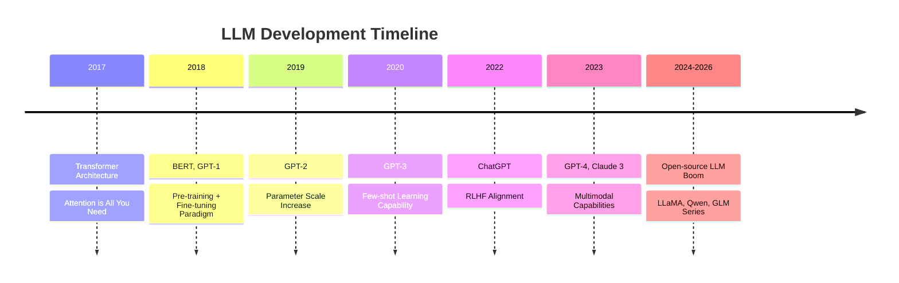

# **Large Language Models (LLM)**

A Comprehensive Guide to Principles and Training Method

<div class="pt-15">
  <div class="text-lg">
    <strong>Kai Ye</strong>
  </div>
  <div class="text-base opacity-80 pt-2">
    LSE | Stats-Powered AI
  </div>
</div>

<div class="pt-20">
  <span @click="$slidev.nav.next" class="px-2 py-1 rounded cursor-pointer" hover="bg-white bg-opacity-10">
    Start <carbon:arrow-right class="inline"/>
  </span>
</div>

---
layout: default
---

# Table of Contents

## Part 1: Foundations
- Introduction to LLMs
- Transformer Architecture

## Part 2: Pre-training and Supervised Fine-Tuning
- Pre-training Methods
- Supervised Fine-Tuning (SFT)

## Part 3: Reinforcement Learning
- RLHF (Reinforcement Learning from Human Feedback)
- RLVR (Reinforcement Learning with Verifiable Rewards)

---
layout: section
---

# Part 1: Foundations

---
layout: section
---

# Introduction to Large Language Models

---

# Definition of LLM

Large Language Models (LLMs) are deep learning-based natural language processing models

<v-clicks>

- **Massive Scale**: Contains billions to trillions of parameters
- **Pre-training**: Unsupervised learning on massive text corpora
- **General Capability**: Can complete multiple NLP tasks
- **Context Understanding**: Can understand and generate coherent text

</v-clicks>

<v-click>

<div class="mt-8 p-4 bg-blue-50 rounded">
💡 Representative Models: GPT-4, Claude, LLaMA, PaLM, GLM, etc.
</div>

</v-click>

---

# Evolution of LLM



---
layout: section
---

# Transformer Architecture

---

# Transformer: The Foundation

<div class="grid grid-cols-2 gap-4">

<div>

## Core Components

- **Self-Attention Mechanism**
  - Captures long-range dependencies
  - High parallel computation efficiency

- **Positional Encoding**
  - Preserves sequence order information

- **Multi-Head Attention**
  - Learns representations from multiple subspaces

- **Feed-Forward Neural Network**
  - Non-linear transformations

</div>

<div>

```python
# Core Attention Formula
def attention(Q, K, V):
    """
    Q: Query
    K: Key
    V: Value
    """
    d_k = K.size(-1)
    scores = Q @ K.transpose(-2, -1)
    scores = scores / sqrt(d_k)
    attention_weights = softmax(scores)
    output = attention_weights @ V
    return output
```

$$
\text{Attention}(Q,K,V) = \text{softmax}\left(\frac{QK^T}{\sqrt{d_k}}\right)V
$$

</div>

</div>

---
layout: section
---

# Part 2: Pre-training and Supervised Fine-Tuning

# Pre-training Methods

<div class="grid grid-cols-3 gap-4">

<div class="p-4 border rounded">

### Autoregressive (AR)
**GPT Series**

- Predict next token
- Unidirectional attention
- Strong generation capability

```
The cat sits on → [the]
```

</div>

<div class="p-4 border rounded">

### Autoencoding (AE)
**BERT Series**

- Masked language model
- Bidirectional attention
- Strong understanding capability

```
The [MASK] sits on → [cat]
```

</div>

<div class="p-4 border rounded">

### Hybrid Methods
**T5, GLM**

- Combines both advantages
- Unified framework
- Balanced capabilities

```
<span> sits on → [The cat]
```

</div>

</div>

---

# Training Pipeline

````md magic-move
```python
# 1. Data Preparation
data = load_corpus([
    "CommonCrawl",
    "Wikipedia", 
    "Books",
    "Code"
])
```

```python
# 2. Pre-training
model = Transformer(
    vocab_size=50000,
    hidden_size=4096,
    num_layers=32,
    num_heads=32
)

for batch in data:
    loss = model.compute_loss(batch)
    loss.backward()
    optimizer.step()
```

```python
# 3. Supervised Fine-Tuning (SFT)
instruction_data = load_instruction_dataset()

for (instruction, response) in instruction_data:
    output = model(instruction)
    loss = cross_entropy(output, response)
    loss.backward()
    optimizer.step()
```
````

---

# Supervised Fine-Tuning (SFT)

<div class="grid grid-cols-2 gap-4">

<div>

## Process

1. **Instruction Dataset**
   - Human-written examples
   - (Input, Output) pairs

2. **Training Objective**
   - Maximize likelihood of target response
   - Standard cross-entropy loss

3. **Result**
   - Model learns to follow instructions
   - Better task-specific performance

</div>

<div>

## Example

```python
# Instruction-Response Pair
instruction = """
Summarize the following text:
Large language models are...
"""

response = """
LLMs are AI systems trained 
on massive text data that can
understand and generate human
language.
"""

# Training
logits = model(instruction)
loss = cross_entropy(logits, response)
```

</div>

</div>

---
layout: section
---

# Part 3: Reinforcement Learning

---

# Core Capabilities Overview

<div class="grid grid-cols-2 gap-8">

<div>

## 🎯 Language Understanding
- Semantic comprehension
- Sentiment analysis
- Named entity recognition
- Relation extraction

## 📝 Text Generation
- Creative writing
- Code generation
- Summarization
- Translation

</div>

<div>

## 🧠 Reasoning Ability
- Logical reasoning
- Mathematical computation
- Common sense reasoning
- Causal reasoning

## 🔄 In-Context Learning
- Few-shot learning
- Zero-shot learning
- Chain-of-thought reasoning
- Tool usage

</div>

</div>

---

# In-Context Learning

<div class="mt-4">

## Prompt Examples

````md
**Zero-shot**
```
Translate the following to English:
今天天气真好。

Today's weather is really nice.
```

**Few-shot**
```
Translate Chinese to English:
Example 1: 你好 → Hello
Example 2: 谢谢 → Thank you
Example 3: 再见 → Goodbye

今天天气真好。 → Today's weather is really nice.
```

**Chain-of-Thought**
```
Question: Roger has 5 tennis balls. He buys 2 more cans of
tennis balls. Each can has 3 tennis balls. How many does he have now?

Let's think step by step:
1. Roger starts with 5 tennis balls
2. He buys 2 cans, each with 3 balls, so that's 2×3=6 balls
3. Total: 5+6=11 tennis balls

Answer: 11 tennis balls
```
````

</div>

---
layout: section
---

# Application Scenarios of LLM

---

# Application Domains

<div class="grid grid-cols-2 gap-6">

<div>

### 🤖 Conversational Systems
- Intelligent customer service
- Personal assistants
- Virtual companions

### 💼 Office Automation
- Email composition
- Document summarization
- Meeting transcription

### 🎓 Education
- Personalized tutoring
- Homework grading
- Knowledge Q&A

</div>

<div>

### 💻 Programming Assistance
- Code generation
- Bug fixing
- Code explanation

### 🔬 Research Assistant
- Literature review
- Experiment design
- Paper writing

### 🎨 Creative Industries
- Content creation
- Script generation
- Advertising copywriting

</div>

</div>

---

# Real-world Example: Code Assistant

<div class="grid grid-cols-2 gap-4">

<div>

**Input Prompt**

```markdown
Write a Python function to
calculate the nth Fibonacci number
using dynamic programming optimization
```

</div>

<div>

**LLM Output**

```python
def fibonacci(n):
    """
    Calculate Fibonacci using dynamic programming
    Time complexity: O(n)
    Space complexity: O(1)
    """
    if n <= 1:
        return n
    
    prev, curr = 0, 1
    for _ in range(2, n + 1):
        prev, curr = curr, prev + curr
    
    return curr

# Test
print(fibonacci(10))  # Output: 55
```

</div>

</div>

---
layout: section
---

# Challenges and Future of LLM

---

# Current Challenges

<v-clicks>

### 🎯 Technical Challenges
- **Hallucination**: Generating inaccurate or false information
- **Reasoning Ability**: Limitations in complex logic and math reasoning
- **Long Context**: Context window limitations
- **Computational Cost**: High training and inference costs

### ⚖️ Ethical Challenges
- **Bias and Fairness**: Biases in training data
- **Privacy Protection**: Risk of sensitive information leakage
- **Copyright Issues**: Ownership of generated content
- **Security Risks**: Malicious use and abuse

### 🌍 Social Impact
- **Employment Impact**: Automation of certain jobs
- **Education Transformation**: Changes in learning methods
- **Information Authenticity**: Deepfake content

</v-clicks>

---

# Future Directions

<div class="grid grid-cols-2 gap-6">

<div>

### 🚀 Technical Evolution

<v-clicks>

- **Multimodal Fusion**
  - Text + Image + Audio + Video

- **Embodied Intelligence**
  - Interaction with physical world

- **Continual Learning**
  - Real-time knowledge updates

- **Efficient Architectures**
  - Reduce computational costs

</v-clicks>

</div>

<div>

### 🎯 Application Deepening

<v-clicks>

- **Domain-Specific Models**
  - Medical, legal, financial domains

- **Personalization**
  - Adapt to individual habits and needs

- **Agent Systems**
  - Autonomous planning and task execution

- **Human-AI Collaboration**
  - Augment human capabilities

</v-clicks>

</div>

</div>

---

# Important Open Source Projects

<div class="grid grid-cols-2 gap-4">

<div>

### Models
- **LLaMA Series** (Meta)
- **Qwen Series** (Alibaba)
- **GLM Series** (Zhipu AI)
- **Mistral** (Mistral AI)

### Training Frameworks
- **DeepSpeed** (Microsoft)
- **Megatron-LM** (NVIDIA)
- **ColossalAI** (HPC-AI Tech)

</div>

<div>

### Inference Frameworks
- **vLLM** - Efficient inference
- **llama.cpp** - CPU inference
- **TensorRT-LLM** (NVIDIA)

### Application Frameworks
- **LangChain** - Application development
- **LlamaIndex** - Knowledge retrieval
- **Semantic Kernel** (Microsoft)

</div>

</div>

---
layout: center
class: text-center
---

# Thank You!

<div class="pt-12">
  <span class="text-6xl">🤖</span>
</div>

<div class="pt-8 text-xl">
  Explore the Infinite Possibilities of LLM
</div>

<div class="abs-br m-6 flex gap-2">
  <a href="https://github.com/slidevjs/slidev" target="_blank" alt="GitHub"
    class="text-xl slidev-icon-btn opacity-50 !border-none !hover:text-white">
    <carbon-logo-github />
  </a>
</div>
